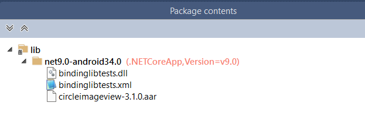

# Distributing bindings libraries

Once a Java library has been bound to be used in .NET for Android, there
are multiple ways it can be consumed:

- **Project Reference** - If the binding project and the application project
  are in the same solution file, using a `<ProjectReference>` is generally 
  the easiest way to consume the binding.
  
- **NuGet Package** - A NuGet package is ideal for public publishing or for
  an internal distributed development environment that has an internal NuGet
  server.
  
- **File Reference** - A consuming application can directly add a `<Reference>`
  to a binding `.dll` if neither the binding project nor a NuGet server is
  available.
  
## Controlling binding and packaging options

A bindings library project has two options for controlling if an `<AndroidLibrary>`
gets bound and gets redistributed:

- **Bind** (`true`/`false`) - Defaults to `true`, meaning managed bindings are
created for the specified `<AndroidLibrary>`.  Setting to `false` means the Java
library will be included in the output, but will not have managed bindings.  This
is useful if the library a needed dependency of another Java library, but it will
not be called from C#.

```xml
<!-- Java library will have C# bindings and be included in the output -->
<AndroidLibrary Include="okhttp-4.12.0.jar" />

<!-- Java library will not have C# bindings but will still be included in the output -->
<AndroidLibrary Include="okio-3.9.0.jar" Bind="false" />
```

- **Pack** (`true`/`false`) - Defaults to `true`, meaning the specified `<AndroidLibrary>`
will be included in the output (such as a NuGet package).  Setting to `false` means the Java
library will not be included in the output. This is a rare scenario in case the dependency is
already being provided via alternative means.

```xml
<!-- Java library will have C# bindings and be included in the output -->
<AndroidLibrary Include="okhttp-4.12.0.jar" />

<!-- Java library will have C# bindings but will *not* be included in the output -->
<AndroidLibrary Include="okio-3.9.0.jar" Pack="false" />
```

## ProjectReference

If the binding project and the application project are in the same solution file, 
using a `<ProjectReference>` is generally the easiest way to consume the binding:

```xml
<ProjectReference Include="mybindinglib.csproj" />
```

The build system will be responsible for adding the managed bindings as well as any
`.jar`/`.aar` files to the application project.

## NuGet package

As a property inherited from .NET SDK-style projects, any bindings library can be
trivially packaged into a redistributable NuGet package by using the "Pack" command
in Visual Studio or from the command line:

```dotnetcli
dotnet pack
```

The bindings library as well as the Java library will be included in the NuGet package:



Use the `Pack` attribute documented above to control which Java libraries are desired
in the NuGet package.

NuGet packages can be customized using the [standard .NET MSBuild elements](/nuget/create-packages/creating-a-package-dotnet-cli#set-properties).

## File reference

If neither of the above options are possible, the binding `.dll` can be referenced
directly with a `<Reference>` element. Note that any Java libraries that are part
of the binding project output must be in the **same directory** as the binding `.dll`.

If you move/copy just the binding `.dll` to another location and do not also move/copy
any `.jar`/`.dll` files they will not end up in your application and the binding will
fail at runtime.

> [!IMPORTANT]
> In Classic Xamarin.Android using an item action like `EmbeddedJar` would place the `.jar` file inside the `.dll` and only one file would be needed. Support for this was removed in .NET for Android because it greatly increased application build time to scan and extract embedded Java library files. Any needed `.jar`/`.dll` files MUST be located in the same directory as the binding `.dll`.
