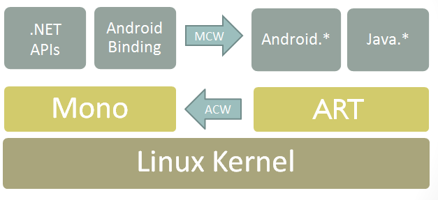

# Binding Java libraries

The third-party library ecosystem for Android is massive. Because of this, it frequently makes sense to use an existing 
Android library than to create a new one. 

.NET for Android allows you to do this with a *Bindings Library* that automatically wraps the library with C# wrappers so you can invoke Java code via C# calls.

This is implemented by using *Managed Callable Wrappers* (*MCW*). MCW is a JNI bridge that is used when managed code needs to invoke Java code. Managed callable wrappers also provide support for subclassing Java types and for overriding virtual methods on Java types. Likewise, whenever Android runtime (ART) code wishes to invoke managed code, it does so via another JNI bridge known as Android Callable Wrappers (ACW). This architecture is illustrated in the following diagram:

[](images/architecture.png#lightbox)

A Bindings Library is an assembly containing Managed Callable Wrappers for Java types. For example, here is a Java type, `MyClass`, that we want to wrap in a Bindings Library:

```java
package com.contoso.mycode;

public class MyClass
{
    public String myMethod (int i) { ... }
}
```

After we generate a Bindings Library for the **.jar** that contains `MyClass`, we can instantiate it and call methods on it from C#:

```csharp
var instance = new MyClass ();

string result = instance.MyMethod (42);
```

To create this Bindings Library, you use the .NET for Android *Android Java Binding Library* template. The resulting binding project creates a .NET assembly with the MCW classes, **.jar**/**.aar** file(s), and resources for Android Library projects embedded in it. By referencing the resulting Bindings Library assembly, you can reuse an existing Java library in your .NET for Android project.

When you reference types in your Binding Library, you must use the namespace of your binding library. Typically, you add a `using` directive at the top of your C# source files that is the .NET namespace version of the Java package name. For example, if the Java package name for your bound **.jar** is the following:

```csharp
com.contoso.package
```

Then you would put the following `using` statement at the top of your C# source files to access types in the bound **.jar** file:

```csharp
using Com.Contoso.Package;
```

When binding an existing Android library, it is necessary to keep the following points in mind:

- **Are there any external dependencies for the library?** &ndash; Any Java dependencies required by the Android library must be included in the .NET for Android project via a NuGet package or as an **AndroidLibrary**. Any native assemblies must be added to the binding project as an **AndroidNativeLibrary**.  

- **What version of the Android API does the Android library target?** &ndash; It is not possible to "downgrade" the Android API level; ensure that the .NET for Android binding project is targeting the same API level (or higher) as the Android library.

## Adapting Java APIs to C&eparsl;

The .NET for Android Binding Generator will change some Java idioms and patterns to correspond to .NET patterns. The following list describes how Java is mapped to C#/.NET:

- _Setter/Getter methods_ in Java are _Properties_ in .NET.

- _Fields_ in Java are _Properties_ in .NET.

- _Listeners/Listener Interfaces_ in Java are _Events_ in .NET. The parameters of methods in the callback interfaces will be represented by an `EventArgs` subclass.

- A _Static Nested class_ in Java is a _Nested class_ in .NET.

- An _Inner class_ in Java is a _Nested class_ with an instance constructor in C#.

## Including a native library in a binding

It may be necessary to include a **.so** library in a .NET for Android binding project as a part of binding a Java library. When the wrapped Java code executes, .NET for Android will fail to make the JNI call and the error message _java.lang.UnsatisfiedLinkError: Native method not found:_ will appear in the logcat out for the application.

The fix for this is to manually load the **.so** library with a call to `Java.Lang.JavaSystem.LoadLibrary`. For example assuming that a .NET for Android project has shared library **libpocketsphinx_jni.so** included in the binding project with a build action of **AndroidNativeLibrary**, the following snippet (executed before using the shared library) will load the **.so** library:

```csharp
Java.Lang.JavaSystem.LoadLibrary("pocketsphinx_jni");
```

## Binding scenarios

The following binding scenario guides can help you bind a Java library (or libraries) for incorporation into your app:

- [Binding a Java library](binding-java-library.md)
    is a walkthrough for creating Bindings Libraries for locally available **.jar**/**.aar** files.

- [Binding a Java library from Maven](binding-java-maven-library.md) is a walkthrough for creating Bindings Libraries for **.jar**/**.aar** files that are hosted in a Maven repository.

- [Customizing bindings](../customizing-bindings/index.md) explains how to make manual modifications to the binding to resolve build errors and shape the resulting API so that it is more "C#-like".

- [Troubleshooting bindings](../customizing-bindings/troubleshooting-bindings.md) lists common binding error scenarios, explains possible causes, and offers suggestions for resolving these errors.
