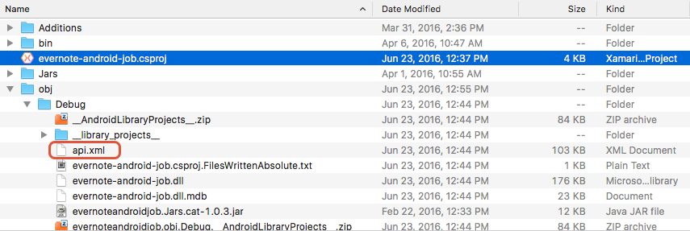

# Java bindings metadata

A .NET for Android **Java Binding Library** tries to automate much of
the work necessary for binding an existing Android library with the
help of a tool sometimes known as the _Bindings Generator_. When
binding a Java library, .NET for Android will inspect the Java classes
and generate a list of all the packages, types, and members which to be
bound. This list of APIs is stored in an XML file that can be found at
**\{project directory}\obj\{Configuration}\api.xml**.



The Bindings Generator will use the **api.xml** file as a guideline for
generating the necessary C# wrapper classes. The following snippet is an example of the contents of **api.xml**:

```xml
<api>
    <package name="android">
        <class abstract="false" deprecated="not deprecated" extends="java.lang.Object"
            extends-generic-aware="java.lang.Object" 
            final="true" 
            name="Manifest" 
            static="false" 
            visibility="public">
            <constructor deprecated="not deprecated" final="false"
                name="Manifest" static="false" type="android.Manifest"
                visibility="public">
            </constructor>
        </class>
...
</api>
```

In this example, **api.xml** declares a class in the `android` package
named `Manifest` that extends the `java.lang.Object`.

In many cases, human assistance is required to make the Java API feel
more ".NET like" or to correct issues that prevent the binding assembly
from compiling. For example, it may be necessary to change Java package
names to .NET namespaces, rename a class, or change the return type of
a method.

These changes should not be achieved by modifying **api.xml** directly.
Instead, changes are recorded in special XML files that are provided by
the Java Binding Library template. When compiling the .NET for Android
binding assembly, the Bindings Generator will be influenced by these
mapping files when creating the binding assembly

The **Metadata.xml** file is the most important of these files as it
allows general-purpose changes to the binding such as:

- Renaming namespaces, classes, methods, or fields so they follow 
    .NET conventions. 

- Removing namespaces, classes, methods, or fields that aren't 
    needed. 

- Moving classes to different namespaces. 

- Adding additional support classes to make the design of the binding 
    follow .NET framework patterns. 

## Metadata.xml transform file

As we've already learned, the file **Metadata.xml** is used by the
Bindings Generator to influence the creation of the binding assembly.
The metadata format uses [XPath](https://www.w3.org/TR/xpath/) syntax. 

This implementation is almost a complete implementation of XPath
1.0 and thus supports items in the 1.0 standard. This file is a
powerful XPath based mechanism to change, add, hide, or move any
element or attribute in the API file. All of the rule elements in the
metadata spec include a `path` attribute to identify the node(s) to which
the rule is to be applied. The following are the available element types:

- **add-node** &ndash; Appends a child node to the node specified by the path attribute.
- **attr** &ndash; Sets the value of an attribute of the element specified by the path attribute.
- **remove-node** &ndash; Removes nodes matching a specified XPath.

The following is an example of a **Metadata.xml** file:

```xml
<metadata>
    <!-- Normalize the namespace for .NET -->
    <attr path="/api/package[@name='com.evernote.android.job']" 
        name="managedName">Evernote.AndroidJob</attr>

    <!-- Don't need these packages for the .NET for Android binding/public API --> 
    <remove-node path="/api/package[@name='com.evernote.android.job.v14']" />
    <remove-node path="/api/package[@name='com.evernote.android.job.v21']" />

    <!-- Change a parameter name from the generic p0 to a more meaningful one. -->
    <attr path="/api/package[@name='com.evernote.android.job']/class[@name='JobManager']/method[@name='forceApi']/parameter[@name='p0']" 
        name="name">api</attr>
</metadata>
```

The following lists some of the more commonly used XPath elements for
the Java API's:

- `interface` &ndash; Used to locate a Java interface. e.g. `/interface[@name='AuthListener']`.

- `class` &ndash; Used to locate a class . e.g. `/class[@name='MapView']`.

- `method` &ndash; Used to locate a method on a Java class or interface. e.g. `/class[@name='MapView']/method[@name='setTitleSource']`.

- `parameter` &ndash; Identify a parameter for a method. e.g. `/parameter[@name='p0']`

### Adding types

The `add-node` element will tell the .NET for Android binding project to
add a new class to **api.xml**. For example, the following
snippet will direct the Binding Generator to create a class with a
constructor and a single field:

```xml
<add-node path="/api/package[@name='org.alljoyn.bus']">
    <class abstract="false" deprecated="not deprecated" final="false" name="AuthListener.AuthRequest" static="true" visibility="public" extends="java.lang.Object">
        <constructor deprecated="not deprecated" final="false" name="AuthListener.AuthRequest" static="false" type="org.alljoyn.bus.AuthListener.AuthRequest" visibility="public" />
        <field name="p0" type="org.alljoyn.bus.AuthListener.Credentials" />
    </class>
</add-node>
```

### Removing types

It is possible to instruct the .NET for Android Bindings Generator to
ignore a Java type and not bind it. This is done by adding a
`remove-node` XML element to the **Metadata.xml** file:

```xml
<remove-node path="/api/package[@name='{package_name}']/class[@name='{name}']" />
```

### Renaming members

Renaming members cannot be done by directly editing the **api.xml**
file because .NET for Android requires the original Java 
Native Interface (JNI) names to talk to Java. Therefore, the `//class/@name` attribute 
cannot be altered; if it is, the binding will not work.

Consider the case where we want to rename a type, `android.Manifest`.
To accomplish this, we might try to directly edit **api.xml** and
rename the class like so:

```xml
<attr path="/api/package[@name='android']/class[@name='Manifest']" 
    name="name">NewName</attr>
```

This will result in the Bindings Generator creating the following C#
code for the wrapper class:

```csharp
[Register ("android/NewName")]
public class NewName : Java.Lang.Object { ... }
```

Notice that the wrapper class has been renamed to `NewName`, while the
original Java type is still `Manifest`. It is no longer possible for
the .NET for Android binding class to access any methods on
`android.Manifest`; the wrapper class is bound to a non-existent Java
type.

To properly change the "managed" name of a wrapped type (or method), it
is necessary to set the `managedName` attribute as shown in this
example:

```xml
<attr path="/api/package[@name='android']/class[@name='Manifest']" 
    name="managedName">NewName</attr>
```

Using `managedName` is required when trying to rename any member, such
as classes, interfaces, methods, and parameters.

<a name="Renaming_EventArg_Wrapper_Classes"></a>

#### Renaming `EventArg` wrapper classes

When the .NET for Android binding generator identifies an `onXXX` setter
method for a _listener type_, a C# event and `EventArgs` subclass will
be generated to support a .NET flavoured API for the Java-based
listener pattern. As an example, consider the following Java class and
method:

```xml
com.someapp.android.mpa.guidance.NavigationManager.on2DSignNextManuever(NextManueverListener listener);
```

.NET for Android will drop the prefix `on` from the setter method and
instead use `2DSignNextManuever` as the basis for the name of the
`EventArgs` subclass. The subclass will be named something similar to:

```csharp
NavigationManager.2DSignNextManueverEventArgs
```

This is not a legal C# class name. To correct this problem, the binding
author must use the `argsType` attribute and provide a valid C# name
for the `EventArgs` subclass:

```xml
<attr path="/api/package[@name='com.someapp.android.mpa.guidance']/
    interface[@name='NavigationManager.Listener']/
    method[@name='on2DSignNextManeuver']" 
    name="argsType">NavigationManager.TwoDSignNextManueverEventArgs</attr>
```

## Supported attributes

The following sections describe some of the attributes for transforming Java APIs.

### argsType

This attribute is placed on setter methods to name the `EventArg`
subclass that will be generated to support Java listeners. This is
described in more detail the section
[Renaming EventArg Wrapper Classes](#Renaming_EventArg_Wrapper_Classes)
in this guide.

### eventName

Specifies a name for an event. If the name is empty, it prevents event generation.
This is described in more detail in the section
[Renaming EventArg Wrapper Classes](#Renaming_EventArg_Wrapper_Classes).

### managedName

This is used to change the name of a package, class, method, or
parameter. For example to change the name of the Java class `MyClass`
to `NewClassName`:

```xml
<attr path="/api/package[@name='com.my.application']/class[@name='MyClass']" 
    name="managedName">NewClassName</attr>
```

The next example illustrates an XPath expression for renaming the
method `java.lang.object.toString` to
`Java.Lang.Object.NewManagedName`:

```xml
<attr path="/api/package[@name='java.lang']/class[@name='Object']/method[@name='toString']" 
    name="managedName">NewMethodName</attr>
```

### managedType

`managedType` is used to change the return type of a method. In some
situations the Bindings Generator will incorrectly infer the return
type of a Java method, which will result in a compile time error. One
possible solution in this situation is to change the return type of the
method.

For example, the Bindings Generator believes that the Java method
`de.neom.neoreadersdk.resolution.compareTo()` should return an `int` and take `Object` as parameters,
which results in the error message **Error CS0535:
'DE.Neom.Neoreadersdk.Resolution' does not implement interface member
'Java.Lang.IComparable.CompareTo(Java.Lang.Object)'**. 
The following
snippet demonstrates how to change the first parameter's type of the generated C#
method from a `DE.Neom.Neoreadersdk.Resolution` to a `Java.Lang.Object`: 

```xml
<attr path="/api/package[@name='de.neom.neoreadersdk']/
    class[@name='Resolution']/
    method[@name='compareTo' and count(parameter)=1 and
    parameter[1][@type='de.neom.neoreadersdk.Resolution']]/
    parameter[1]" name="managedType">Java.Lang.Object</attr> 
```

### managedReturn

Changes the return type of a method. This does not change the return
attribute (as changes to return attributes can result in incompatible
changes to the JNI signature). In the following example, the return
type of the `append` method is changed from `SpannableStringBuilder` to
`IAppendable`:

```xml
<attr path="/api/package[@name='android.text']/
    class[@name='SpannableStringBuilder']/
    method[@name='append']" 
    name="managedReturn">Java.Lang.IAppendable</attr>
```

### obfuscated

Tools that obfuscate Java libraries may interfere with the
.NET for Android Binding Generator and its ability to generate C#
wrapper classes. Characteristics of obfuscated classes include: 

- The class name includes a **$**, i.e. **a$.class**
- The class name is entirely compromised of lower case characters, i.e. **a.class**

This snippet is an example of how to generate an "un-obfuscated" C# type:

```xml
<attr path="/api/package[@name='{package_name}']/class[@name='{name}']" 
    name="obfuscated">false</attr>
```

### propertyName

This attribute can be used to change the name of a managed property.

A specialized case of using `propertyName` involves the situation where
a Java class has only a setter method for a field. In this situation
the Binding Generator would want to create a write-only property,
something that is discouraged in .NET. The following snippet shows how
to "remove" the .NET properties by setting the `propertyName` to an
empty string:

```xml
<attr path="/api/package[@name='org.java_websocket.handshake']/class[@name='HandshakeImpl1Client']/method[@name='setResourceDescriptor' 
    and count(parameter)=1 
    and parameter[1][@type='java.lang.String']]" 
    name="propertyName"></attr>
<attr path="/api/package[@name='org.java_websocket.handshake']/class[@name='HandshakeImpl1Client']/method[@name='getResourceDescriptor' 
    and count(parameter)=0]" 
    name="propertyName"></attr>
```

Note that the setter and getter methods will still be created by the
Bindings Generator, they just will not be converted to a .NET property.

### sender

Specifies which parameter of a method should be the `sender` parameter
when the method is mapped to an event. The value can be `true` or
`false`. For example:

```xml
<attr path="/api/package[@name='android.app']/
    interface[@name='TimePickerDialog.OnTimeSetListener']/
    method[@name='onTimeSet']/
    parameter[@name='view']" 
    name="sender">true</ attr>
```

### visibility

This attribute is used to change the visibility of a class, method, or
property. For example, it may be necessary to promote a `protected`
Java method so that it's corresponding C# wrapper is `public`:

```xml
<!-- Change the visibility of a class -->
<attr path="/api/package[@name='namespace']/class[@name='ClassName']" name="visibility">public</attr>

<!-- Change the visibility of a method --> 
<attr path="/api/package[@name='namespace']/class[@name='ClassName']/method[@name='MethodName']" name="visibility">public</attr>
```

## Related links

- [Binding Java libraries](../binding-java-libs/index.md)
- [Metadata cheat sheet](https://github.com/xamarin/java.interop/wiki/Metadata-Cheat-Sheet)
- [Troubleshooting bindings](troubleshooting-bindings.md)
