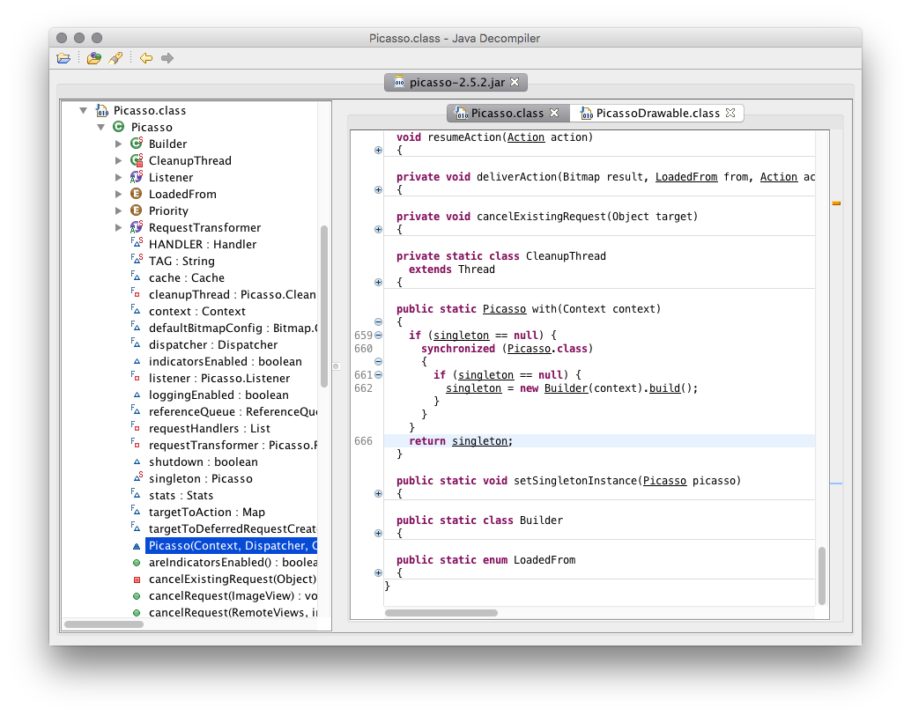
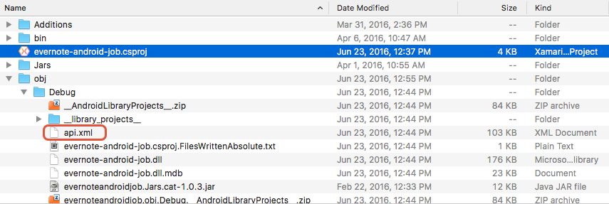

# Troubleshooting bindings

Binding an Android library (an **.aar** or a **.jar**) file is seldom a
straightforward affair; it usually requires additional effort to
mitigate issues that result from the differences between Java and .NET.
These issues will prevent .NET for Android from binding the Android
library and present themselves as error messages in the build log. This
guide will provide some tips for troubleshooting the issues, list some
of the more common problems/scenarios, and provide possible solutions
to successfully binding the Android library.

When binding an existing Android library, it is necessary to keep in mind the following points:

- **The external dependencies for the library** &ndash; Any Java
  dependencies required by the Android library must be included in the
  .NET for Android project via a NuGet package or as an **AndroidLibrary**.

- **The Android API level that the Android library is targetting**
  &ndash; It is not possible to "downgrade" the Android API level;
  ensure that the .NET for Android binding project is targeting the same
  API level (or higher) as the Android library.

> [!TIP]
> The [Binding Tooling GitHub repository wiki](https://github.com/xamarin/java.interop/wiki/Troubleshooting-Android-Bindings-Issues) is a great resource and contains additional troubleshooting information that may help with specific cases.

The first step to troubleshooting issues with binding a .NET for Android
library is to enable
[diagnostic MSBuild output](/visualstudio/ide/how-to-view-save-and-configure-build-log-files#to-change-the-amount-of-information-included-in-the-build-log).
After enabling the diagnostic output, rebuild the .NET for Android
binding project and examine the build log to locate clues about what
the cause of problem is.

It can also prove helpful to decompile the Android library and examine
the types and methods that .NET for Android is trying to bind. This is
covered in more detail later on in this guide.

## Decompiling an Android library

Inspecting the classes and methods of the Java classes can provide
valuable information that will assist in binding a library.
[JD-GUI](http://jd.benow.ca/) is a graphical utility that can display
Java source code from the **CLASS** files contained in a JAR.

To decompile an Android library open the **.JAR** file with the Java
decompiler. If the library is an **.AAR** file, the Java source code will be
in the **classes.jar** entry of the archive file. The following
is a sample screenshot of using JD-GUI to analyze the
[Picasso](https://square.github.io/picasso/) JAR:



Once you have decompiled the Android library, examine the source code. Generally speaking, look for :

- **Classes that have characteristics of obfuscation** &ndash;
  Characteristics of obfuscated classes include:

  - The class name includes a **$**, i.e. **a$.class**
  - The class name is entirely compromised of lower case characters, i.e. **a.class**      

- **`import` statements for unreferenced libraries** &ndash; Identify
  the unreferenced library and add those dependencies to the
  .NET for Android binding project with an appropriate binding from NuGet or
  with a **Build Action** of **AndroidLibrary**.

> [!NOTE]
> Decompiling a Java library may be prohibited or
> subject to legal restrictions based on local laws or the license under
> which the Java library was published. If necessary, enlist the services
> of a legal professional before attempting to decompile a Java library
> and inspect the source code.

## Inspect api.xml

As a part of building a binding project, .NET for Android will generate
an XML file name **obj/Debug/api.xml**:



This file provides a list of all the Java APIs that .NET for Android is
trying bind. The contents of this file can help identify any missing
types or methods, duplicate binding. Although inspection of this file
is tedious and time consuming, it can provide for clues on what might
be causing any binding problems. For example, **api.xml** might reveal
that a property is returning an inappropriate type, or that there are
two types that share the same managed name.

## Known issues

This section will list some of the common error messages or symptoms
that my occur when trying to bind an Android library.

### Problem: Missing C# types in generated output.

The binding **.dll** builds but misses some Java types, or the
generated C# source does not build due to an error stating there are
missing types.

#### Possible causes:

This error may occur due to several reasons as listed below:

- The library being bound may reference a second Java library. If
  the public API for the bound library uses types from the second
  library, you must reference a managed binding for the second
  library as well.

- Java allows deriving a public class from non-public class, but this
  is unsupported in .NET. Since the binding generator does not
  generate bindings for non-public classes, derived classes such as
  these cannot be generated correctly. To fix this, either remove the
  metadata entry for those derived classes using the remove-node in
  **Metadata.xml**, or fix the metadata that is making the non-public
  class public. Although the latter solution will create the binding
  so that the C# source will build, the non-public class should not
  be used.

  For example:

  ```xml
  <attr path="/api/package[@name='com.some.package']/class[@name='SomeClass']"
      name="visibility">public</attr>
  ```

- Tools that obfuscate Java libraries may interfere with the
  .NET for Android Binding Generator and its ability to generate C#
  wrapper classes. The following snippet shows how to update
  **Metadata.xml** to unobfuscate a class name:

  ```xml
  <attr path="/api/package[@name='{package_name}']/class[@name='{name}']"
      name="obfuscated">false</attr>
  ```

### Problem: Generated C# source does not build due to parameter type mismatch

The generated C# source does not build. Overridden method's parameter
types do not match.

#### Possible causes:

.NET for Android includes a variety of Java fields that are mapped to
enums in the C# bindings. These can cause type incompatibilities in the
generated bindings. To resolve this, the method signatures created from
the binding generator need to be modified to use the enums. For more
information, please see
[Creating enumerations](creating-enums.md).

### Problem: Duplicate custom EventArgs types

Build fails due to duplicate custom EventArgs types. An error like this
occurs:

```shell
error CS0102: The type `Com.Google.Ads.Mediation.DismissScreenEventArgs' already contains a definition for `p0'
```

#### Possible causes:

This is because there is some conflict between event types that come
from more than one interface "listener" type that shares methods having
identical names. For example, if there are two Java interfaces as seen
in the example below, the generator creates `DismissScreenEventArgs`
for both `MediationBannerListener` and `MediationInterstitialListener`,
resulting in the error.

```java
// Java:
public interface MediationBannerListener {
    void onDismissScreen(MediationBannerAdapter p0);
}
public interface MediationInterstitialListener {
    void onDismissScreen(MediationInterstitialAdapter p0);
}
```

This is by design so that lengthy names on event argument types are
avoided. To avoid these conflicts, some metadata transformation is
required. Edit **Transforms\Metadata.xml** and add an `argsType` attribute on either of the interfaces (or on the
interface method):

```xml
<attr path="/api/package[@name='com.google.ads.mediation']/
        interface[@name='MediationBannerListener']/method[@name='onDismissScreen']"
        name="argsType">BannerDismissScreenEventArgs</attr>

<attr path="/api/package[@name='com.google.ads.mediation']/
        interface[@name='MediationInterstitialListener']/method[@name='onDismissScreen']"
        name="argsType">IntersitionalDismissScreenEventArgs</attr>

<attr path="/api/package[@name='android.content']/
        interface[@name='DialogInterface.OnClickListener']"
        name="argsType">DialogClickEventArgs</attr>
```

### Problem: Class does not implement interface method

An error message is produced indicating that a generated class does not
implement a method that is required for an interface which the
generated class implements. However, looking at the generated code, you
can see that the method is implemented.

Here is an example of the error:

```shell
obj\Debug\generated\src\Oauth.Signpost.Basic.HttpURLConnectionRequestAdapter.cs(8,23):
error CS0738: 'Oauth.Signpost.Basic.HttpURLConnectionRequestAdapter' does not
implement interface member 'Oauth.Signpost.Http.IHttpRequest.Unwrap()'.
'Oauth.Signpost.Basic.HttpURLConnectionRequestAdapter.Unwrap()' cannot implement
'Oauth.Signpost.Http.IHttpRequest.Unwrap()' because it does not have the matching
return type of 'Java.Lang.Object'
```

#### Possible causes:

This is a problem that occurs with binding Java methods with covariant
return types. In this example, the method
`Oauth.Signpost.Http.IHttpRequest.UnWrap()` needs to return
`Java.Lang.Object`. However, the method
`Oauth.Signpost.Basic.HttpURLConnectionRequestAdapter.UnWrap()` has a
return type of `HttpURLConnection`. There are two ways to fix this
issue:

- Add a partial class declaration for
  `HttpURLConnectionRequestAdapter` and explicitly implement
  `IHttpRequest.Unwrap()`:

  ```csharp
  namespace Oauth.Signpost.Basic {
      partial class HttpURLConnectionRequestAdapter {
          Java.Lang.Object OauthSignpost.Http.IHttpRequest.Unwrap() {
              return Unwrap();
          }
      }
  }
  ```

- Remove the covariance from the generated C# code. This involves
  adding the following transform to **Transforms\Metadata.xml** which
  will cause the generated C# code to have a return type of
  `Java.Lang.Object`:

  ```xml
  <attr
      path="/api/package[@name='oauth.signpost.basic']/class[@name='HttpURLConnectionRequestAdapter']/method[@name='unwrap']"
      name="managedReturn">Java.Lang.Object
  </attr>
  ```

### Problem: Name collisions on inner classes / properties

Conflicting visibility on inherited objects.

In Java, it's not required that a derived class have the same
visibility as its parent. Java will just fix that for you. In C#, that
has to be explicit, so you need to make sure all classes in the
hierarchy have the appropriate visibility. The following example shows
how to change a Java package name from `com.evernote.android.job` to
`Evernote.AndroidJob`:

```xml
<!-- Change the visibility of a class -->
<attr path="/api/package[@name='namespace']/class[@name='ClassName']" name="visibility">public</attr>

<!-- Change the visibility of a method -->
<attr path="/api/package[@name='namespace']/class[@name='ClassName']/method[@name='MethodName']" name="visibility">public</attr>
```

### Problem: A **.so** library required by the binding is not loading

Some binding projects may also depend on functionality in a **.so**
library. It is possible that .NET for Android will not automatically
load the **.so** library. When the wrapped Java code executes,
.NET for Android will fail to make the JNI call and the error message
_java.lang.UnsatisfiedLinkError: Native method not found:_ will appear
in the logcat out for the application.

The fix for this is to manually load the **.so** library with a call to
`Java.Lang.JavaSystem.LoadLibrary`. For example assuming that a
.NET for Android project has shared library **libpocketsphinx_jni.so**
included in the binding project with a build action of
**EmbeddedNativeLibrary**, the following snippet (executed
before using the shared library) will load the **.so** library:

```csharp
Java.Lang.JavaSystem.LoadLibrary("pocketsphinx_jni");
```

## Related links

- [Troubleshooting Tips on Binding Tooling GitHub repository wiki](https://github.com/xamarin/java.interop/wiki/Troubleshooting-Android-Bindings-Issues)
- [Library Projects](https://developer.android.com/tools/projects/index.html#LibraryProjects)
- [Enable Diagnostic Output](https://aka.ms/binlog)
- [JD-GUI](http://jd.benow.ca/)
