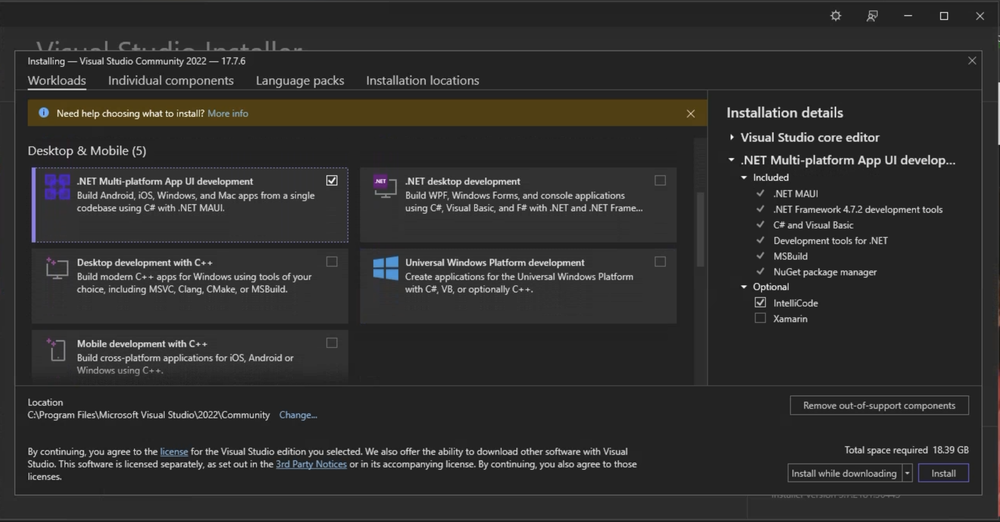
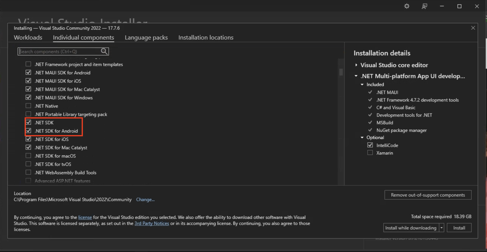
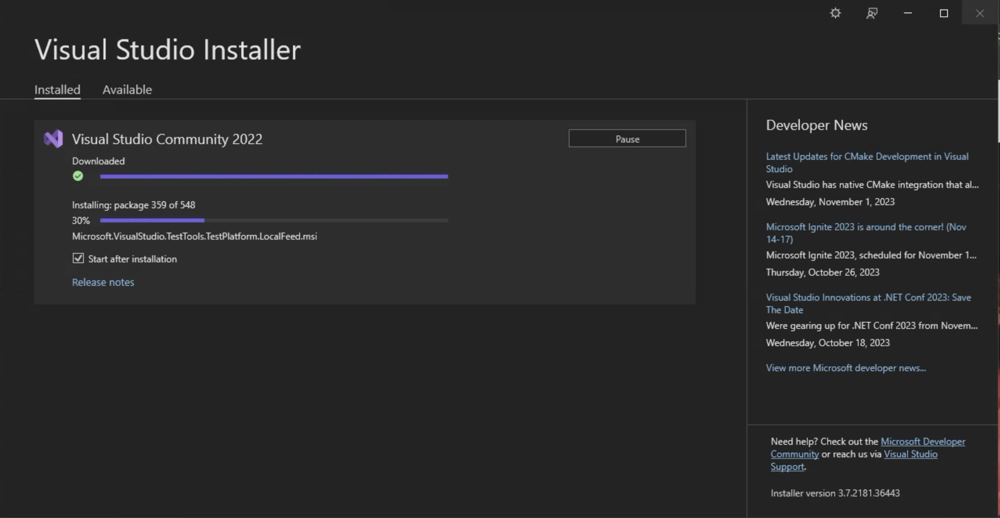
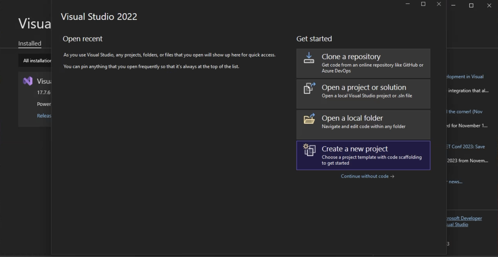
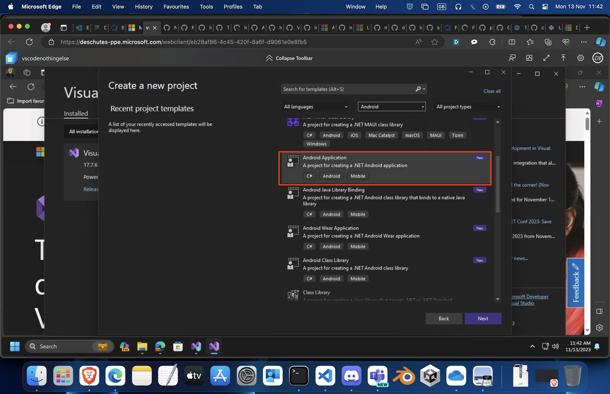

# Install .NET for Android

Developing native, .NET for Android apps requires .NET 6 or higher. Various IDE's can be used, however
we recommend Visual Studio 2022 17.3 or greater, or Visual Studio Code.

<!-- markdownlint-disable MD025 -->
## [Install via the Command Prompt or Terminal](#tab/commandline)
<!-- markdownlint-enable MD025 -->

 1. Install the [latest .NET](https://dotnet.microsoft.com/download) for your particular platform
    and follow its [installation instructions](/dotnet/core/install).

 2. From a Command Prompt or Terminal run:

    ```dotnetcli
    dotnet workload install android
    ```

 3. In order to build Android applications you also need to install the
    [Android SDK and other dependencies](dependencies.md#using-installandroiddependencies-target).


<!-- markdownlint-disable MD025 -->
## [Install via Visual Studio](#tab/visualstudio)
<!-- markdownlint-enable MD025 -->

 1. Install the [latest Visual Studio](https://visualstudio.microsoft.com/downloads/).

 2. Select the .NET Multi Platform App UI Development workload and any other workloads you want.

    

 3. Or select the .NET for Android SDK component from the Individual Components tab.

    

 4. Let the installer run, it may take a while depending on your Internet Connection.

    

 5. Once installed you can run Visual Studio.

    You will be presented with the start up screen. Select New Project:

    

 6. Look through the templates to find the Android Application Template

    
