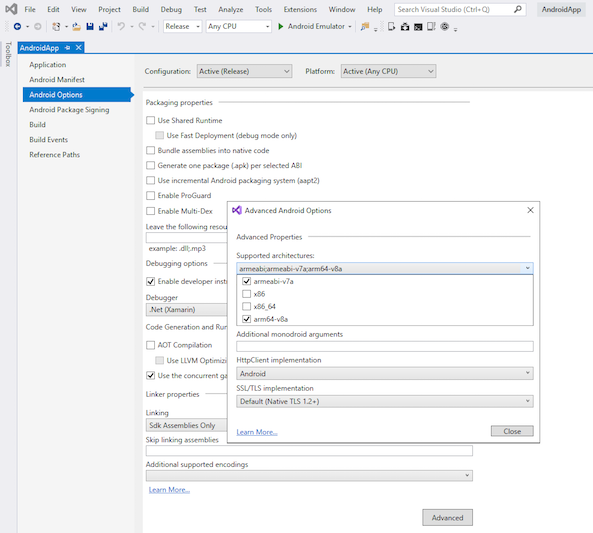
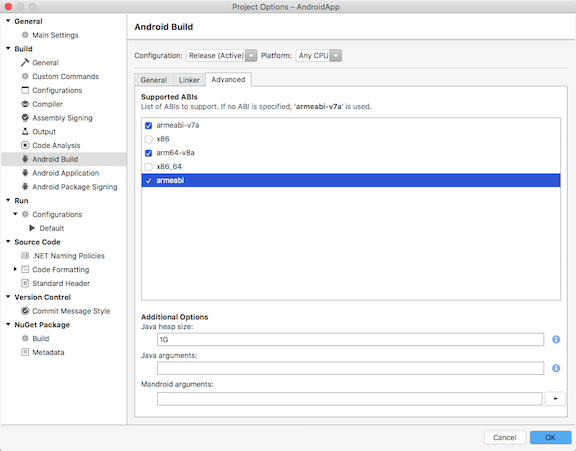

# .NET for Android error XA0115

## Example messages

```
Invalid value 'armeabi' in $(AndroidSupportedAbis). This ABI is no longer supported. Please update your project properties to remove the old value. If the properties page does not show an 'armeabi' checkbox, un-check and re-check one of the other ABIs and save the changes.
```

## Issue

Due to the [removal of armeabi support in Android NDK r17][ndk-guide],
.NET for Android 9.1 is the last version that supports the armeabi architecture.

Example *.csproj* file element for `$(AndroidSupportedAbis)` that will cause the
error:

```xml
<AndroidSupportedAbis>armeabi;armeabi-v7a;arm64-v8a</AndroidSupportedAbis>
```

## Solution

Projects that have this old ABI selected in the `$(AndroidSupportedAbis)`
property will need to be updated to remove it before they will build
successfully with newer versions of .NET for Android.  The newer armeabi-v7a ABI
should now be used instead.

The `armeabi` value can be removed from this property either by editing the
*.csproj* directly or by updating the setting in the Visual Studio property
pages on Windows or macOS.

### Updating the setting on Windows

 1. Select the project in the **Solution Explorer** and click the **Properties**
    icon, or right-click the project and select **Properties**.
 2. In the side pane, choose **Android Options**.
 3. Select the **Advanced** button.
 4. The **Supported architectures** list no longer includes an **armeabi**
    checkbox, so to remove the old armeabi setting, un-check and re-check one of
    the other ABIs, click the **Close** button, and then save the changes.

    

## Updating the setting on macOS

 1. Control-click on the project in the **Solution** pad and select **Options**.
 2. In the side pane, choose **Android Build**.
 3. Select the **Advanced** tab.
 4. In the **Supported ABIs** list, un-check the **armeabi** checkbox and click
    the **OK** button to save the changes.

    

[ndk-guide]: https://developer.android.com/ndk/guides/abis
