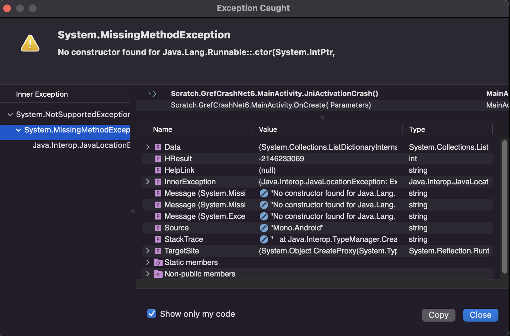

# Debugging JNI Object Reference Crashes

How to debug and diagnose app crashes due to invalid JNI Object References.

## Overview

.NET for Android apps apps make heavy use of the
[Java Native Interface (JNI)](https://docs.oracle.com/javase/8/docs/technotes/guides/jni/spec/jniTOC.html)
to create Java instances, invoke methods on those Java instances, and allow Java interfaces to be implemented
and Java methods to be overridden. When dealing with Java instances,
[JNI Global and Local Object References](https://docs.oracle.com/javase/8/docs/technotes/guides/jni/spec/design.html#global_and_local_references)
are used.

When an app crashes due to use of an invalid JNI Object Reference, there are two typical "forms" of the crash:

  * [Via an unhandled exception](#crash-via-unhandled-exception), or
  * [Via an Android Runtime abort](#crash-dalvik-abort).

In order to diagnose and eventually fix the crash, you will next need to:

 1. [Collect JNI Object Reference logs](#collect-logs), then
 2. [Understand the collected logs](#understand-logs).
 2. [Interpreting the collected logs](#read-logs).

You may find [`logcat-parse`](#logcat-parse) useful in reading the log files.


<a name="crash-unhandled-exception"></a>

### Crash via Unhandled Exception

When debugging an app crashing via an Unhandled Exception, the debugger
will show that a `NotSupportedException` was thrown containing an
inner exception which is a `MissingMethodException`:



`adb logcat` output will contain:

	F mono-rt : [ERROR] FATAL UNHANDLED EXCEPTION: System.NotSupportedException: Unable to activate instance of type Java.Lang.Runnable from native handle 0x7ff1f3b468 (key_handle 0x466b26f).
	F mono-rt :  ---> System.MissingMethodException: No constructor found for Java.Lang.Runnable::.ctor(System.IntPtr, Android.Runtime.JniHandleOwnership)
	F mono-rt :  ---> Java.Interop.JavaLocationException: Exception of type 'Java.Interop.JavaLocationException' was thrown.
	F mono-rt : Java.Lang.Error: Exception of type 'Java.Lang.Error' was thrown.
	F mono-rt : 
	F mono-rt :   --- End of managed Java.Lang.Error stack trace ---
	F mono-rt : java.lang.Error: Java callstack:
	F mono-rt :      …
	F mono-rt :    --- End of inner exception stack trace ---
	F mono-rt :    at Java.Interop.TypeManager.CreateProxy(Type type, IntPtr handle, JniHandleOwnership transfer) in /Users/runner/work/1/s/xamarin-android/src/Mono.Android/Java.Interop/TypeManager.cs:line 348
	F mono-rt :    at Java.Interop.TypeManager.CreateInstance(IntPtr handle, JniHandleOwnership transfer, Type targetType) in /Users/runner/work/1/s/xamarin-android/src/Mono.Android/Java.Interop/TypeManager.cs:line 312
	F mono-rt :    --- End of inner exception stack trace ---
	F mono-rt :    at Java.Interop.TypeManager.CreateInstance(IntPtr handle, JniHandleOwnership transfer, Type targetType) in /Users/runner/work/1/s/xamarin-android/src/Mono.Android/Java.Interop/TypeManager.cs:line 319
	F mono-rt :    at Java.Lang.Object.GetObject(IntPtr handle, JniHandleOwnership transfer, Type type) in /Users/runner/work/1/s/xamarin-android/src/Mono.Android/Java.Lang/Object.cs:line 304
	F mono-rt :    …

In particular, `adb logcat` has a `MissingMethodException` mentioning that a constructor
with the signature `(IntPtr, JniHandleOwnership)` could not be found.

If you see a `NotSupportedException` with
[*anything else* as the inner exception](https://github.com/xamarin/xamarin-android/issues/7324),
then this is *not* due to JNI object references, and the rest of this guide will not help you.
You will need to examine the inner exception to determine the original cause of the exception.

You will need the `key_handle` value from the exception message when
[investigating the log files](#read-logs).

When a `Java.Lang.Object` subclass is instantiated, a "Java peer" is created, and a mapping between
the managed instance and the Java peer instance is created. This mapping can be destroyed when
`Java.Lang.Object.Dispose()` is invoked, or when a Garbage Collection occurs and determines that *both* instances are
eligible for collection.

This crash is more common for Garbage Collector bugs, but can be caused by deliberately misusing things:

```csharp
partial class MainActivity : Activity {
	unsafe void CrashViaUnhandledException()
	{
		var r = new Java.Lang.Runnable(() => { });
		// Create managed subclass of `Java.Lang.Object`

		var h = r.PeerReference.NewGlobalRef();
		// `h` is a JNI Global Object Reference to the Java peer of `r`

		r.Dispose();
		// Destroy the mapping between the JNI object reference `h` and the instance `r`


		// Invoke `Activity.runOnUiThread(Runnable)`, using the now unassociated object reference `h`
		JniArgumentValue* args = stackalloc JniArgumentValue[1];
		args[0] = new JniArgumentValue(h);
		this.JniPeerMembers.InstanceMethods.InvokeVirtualVoidMethod("runOnUiThread.(Ljava/lang/Runnable;)V", this, args);
	}
}
```


<a name="crash-dalvik-abort"></a>

### Crash via Android Runtime vik Abort

[Android Runtime (ART), previously known as Dalvik](https://source.android.com/docs/core/dalvik), is the Java runtime environment on Android devices.

When debugging an app crashing via Android Runtime Abort, the app immediately stops debugging. There is no unhandled exception dialog; there is no exception.

The Application Output window will contain `adb logcat` output similar to:

```
java_vm_ext.cc:579] JNI DETECTED ERROR IN APPLICATION: JNI ERROR (app bug): jobject is an invalid local reference: 0x75 (deleted reference at index 7 in a table of size 7)
```

This happens when an invalid JNI object reference is used. This should *never happen* in normal use, but
can be caused by deliberately misusing things:

```csharp
static unsafe void UseInvalidJniHandle()
{
	var a = new Java.Lang.String("a");
	var b = JniEnvironment.Strings.NewString("b");
	var h = b.Handle;
	JniObjectReference.Dispose(ref b);
	b = new JniObjectReference(h);
	JniArgumentValue* args = stackalloc JniArgumentValue[1];
	args[0] = new JniArgumentValue(b);
	a.JniPeerMembers.InstanceMethods.InvokeNonvirtualBooleanMethod("endsWith.(Ljava/lang/String;)Z", a, args);
}
```

The JNI Object reference `h` is invalidated when `JniObjectReference.Dispose(ref b)` is invoked; `h` is now invalid.
Attempting to subsequently use that value results in the `JNI DETECTED ERROR IN APPLICATION` message and subsequent crash.


<a name="collect-logs"></a>

## Collect JNI Object Reference Logs

In order to diagnose and fix JNI Object Reference usage bugs, JNI Object Reference logs must first be collected.
There are two sets of logs: JNI *Local* Reference logs, and JNI *Global* Reference logs. JNI Local Reference logs
are *incredibly* voluminous; they should be collected only as a last resort.

There are two ways to obtain JNI Object Reference logs:

 1. [Collect the *complete* JNI Object Reference log output](#collect-complete-logs), or
 2. [Collect "best effort" JNI Object Reference log output](#collect-best-effort-logs).


<a name="collect-complete-logs"></a>

### Collect Complete JNI Object Reference Logs

To collect *complete* JNI object reference logs, your app must be "debuggable": the
[`//application/@android:debuggable`](https://developer.android.com/guide/topics/manifest/application-element#debug) attribute
within `AndroidManifest.xml` must have the value `true`. This is typically the case for Debug configuration builds, and
*not* for Release configuration builds. (The Google Play Store requires that submitted apps *not* be debuggable.)

Enable JNI Global Reference log collection by setting the `debug.mono.log` system property to a value which contains `gref`:

	adb shell setprop debug.mono.log gref

Then run your app again and trigger the crash. Once tha app has exited, run:

	adb shell run-as @PACKAGE-NAME@ cat files/.__override__/grefs.txt > grefs.txt

where `@PACKAGE-NAME@` is the value of the [`/manifest/@package` attribute](https://developer.android.com/guide/topics/manifest/manifest-element#package)
within `AndroidManifest.xml`. This is generally the filename before `-Signed.apk` in your `bin` directory.

To collect JNI Local Reference logs, the `debug.mono.log` system property should contain `lref`, and the required file is `lrefs.txt`.

Both Local and Global JNI Object References can be collected at the same time:

	adb shell setprop debug.mono.log lref,gref

	# run the app, then

	adb shell run-as @PACKAGE-NAME@ cat files/.__override__/grefs.txt > grefs.txt
	adb shell run-as @PACKAGE-NAME@ cat files/.__override__/lrefs.txt > lrefs.txt

<a name="collect-best-effort-logs"></a>

### Collect Best Effort JNI Object Reference Logs

Complete JNI Object Reference log collection can only be done for debuggable apps. If your app isn't debuggable,
or the crash doesn't reproduce in a debuggable app, then you will need to try for "Best Effort" collection by
setting the `debug.mono.log` system property to contain either/both `gref+` for Global References and
`lref+` for Local References:

	adb shell setprop debug.mono.log lref+,gref+

Then, begin collecting `adb logcat` *before* launching your app:

	adb logcat -G 16M
	adb logcat > log.txt

Once your app crashes, `log.txt` will contain the JNI Object Reference logs.

*However*, the output *may* be incomplete. It is not unusual for information to be missing, because *so much*
data is written to `adb logcat`.

The `lref+` and `gref+` values to the `debug.mono.log` system property *also* create `lrefs.txt` and `grefs.txt` files.
However, those files will not be readable if the app is not debuggable.


<a name="Understand-logs"></a>

## Understand The Logs

Once you've collected the JNI Object Reference logs, you read them.

There are four messages of consequence:

  * Global reference creation: these are the lines that start with *+g+*,
    and will provide a stack trace for the creating code path.

    ```
    +g+ grefc 1 gwrefc 0 obj-handle 0x1bb6/G -> new-handle 0x1be6/G from thread '(null)'(1)
    ```

  * Global reference destruction: these are the lines that start with *-g-*,
    and may provide a stack trace for the code path disposing of the global reference.

    If the [Garbage Collector](https://docs.microsoft.com/xamarin/android/internals/garbage-collection)
	is disposing of the gref, no stack trace will be provided.

    ```
    +l+ lrefc 1 handle 0xc1/L from thread '(null)'(1)
    ```

  * Weak global reference creation: these are the lines that start with *+w+*.

    ```
    +w+ grefc 27 gwrefc 3 obj-handle 0x1c46/G -> new-handle 0x28b/W from thread 'finalizer'(6931)
    ```

  * Weak global reference destruction: these are lines that start with *-w-*.

    ```
    -w- grefc 28 gwrefc 1 handle 0x297/W from thread 'finalizer'(6931)
    ```

In all messages, the *grefc* value is the count of global references that have been created,
while the *grefwc* value is the count of weak global references that have been created.
The *handle* or *obj-handle* value is the JNI handle value, and the character after the `/` is
the type of handle value: `/L` for local reference, `/G` for global references, and `/W` for weak global references.

Also frequently of consequence are the messages:

  * Handle status: these are lines that start with *handle*, and list the mapping between
    a JNI Global Reference -- logged in a preceding *+g+* message --
    the `key_handle` value -- used for object identity -- the Java type, and the Managed type.

    ```
    handle 0x1c86; key_handle 0x466b26f: Java Type: `java/lang/String`; MCW type: `Java.Lang.String`
    ```

<a name="read-logs"></a>

## Interpreting the Logs

When diagnosing a crash, you start with the JNI Object Reference mentioned in the crash.
Then you search backwards from the end of the collected log files, looking for any and all mentions of the
invalid JNI Object Reference, and -- if available -- the `key_handle` in the error message.


### Unhandled Exception Crash Logs

Consider the [crash via Unhandled Exception](#crash-unhandled-exception):

```
F mono-rt : [ERROR] FATAL UNHANDLED EXCEPTION: System.NotSupportedException: Unable to activate instance of type Java.Lang.Runnable from native handle 0x7ff1f3b468 (key_handle 0x466b26f).
```

After collecting the JNI Global Reference logs, we search backward, from the end, for the values
`0x7ff1f3b468` and `0x466b26f`. (If using `less`, search backwards `?` for the value `0x7ff1f3b468|0x466b26f`.)
This lands us on:

```
handle 0x1cda; key_handle 0x466b26f: Java Type: `mono/java/lang/Runnable`; MCW type: `Java.Lang.Runnable`
```

which is unfortunately the only match. This match gives us a handle `0x1cda`; we can search forwards and
backwards to see what happened with it. In context:

```
 1.  +g+ grefc 12 gwrefc 0 obj-handle 0x79/I -> new-handle 0x1cda/G from thread '(null)'(1)
 2.     at Android.Runtime.AndroidObjectReferenceManager.CreateGlobalReference(JniObjectReference value) in /Users/runner/work/1/s/xamarin-android/src/Mono.Android/Android.Runtime/AndroidRuntime.cs:line 183
 3.     at Java.Interop.JniObjectReference.NewGlobalRef() in /Users/runner/work/1/s/xamarin-android/external/Java.Interop/src/Java.Interop/Java.Interop/JniObjectReference.cs:line 139
 4.     at Android.Runtime.JNIEnv.NewGlobalRef(IntPtr jobject) in /Users/runner/work/1/s/xamarin-android/src/Mono.Android/Android.Runtime/JNIEnv.cs:line 656
 5.     at Android.Runtime.AndroidValueManager.AddPeer(IJavaPeerable value, IntPtr handle, JniHandleOwnership transfer, IntPtr& handleField) in /Users/runner/work/1/s/xamarin-android/src/Mono.Android/Android.Runtime/AndroidRuntime.cs:line 566
 6.     at Java.Lang.Object.SetHandle(IntPtr value, JniHandleOwnership transfer) in /Users/runner/work/1/s/xamarin-android/src/Mono.Android/Java.Lang/Object.cs:line 251
 7.     at Java.Lang.Object..ctor(IntPtr handle, JniHandleOwnership transfer) in /Users/runner/work/1/s/xamarin-android/src/Mono.Android/Java.Lang/Object.cs:line 79
 8.     at Java.Lang.Runnable..ctor(Action handler) in /Users/runner/work/1/s/xamarin-android/src/Mono.Android/Java.Lang/Runnable.cs:line 13
 9.     at Scratch.GrefCrashNet6.MainActivity.JniActivationCrash() in …/Scratch.GrefCrashNet6/Scratch.GrefCrashNet6/MainActivity.cs:line 39
10.     at Scratch.GrefCrashNet6.MainActivity.OnCreate(Bundle savedInstanceState) in …/Scratch.GrefCrashNet6/Scratch.GrefCrashNet6/MainActivity.cs:line 16
11.     at Android.App.Activity.n_OnCreate_Landroid_os_Bundle_(IntPtr jnienv, IntPtr native__this, IntPtr native_savedInstanceState) in /Users/runner/work/1/s/xamarin-android/src/Mono.Android/obj/Release/net6.0/android-31/mcw/Android.App.Activity.cs:line 2781
12.     at Android.Runtime.JNINativeWrapper.Wrap_JniMarshal_PPL_V(_JniMarshal_PPL_V callback, IntPtr jnienv, IntPtr klazz, IntPtr p0) in /Users/runner/work/1/s/xamarin-android/src/Mono.Android/Android.Runtime/JNINativeWrapper.g.cs:line 121
13.
14.  handle 0x1cda; key_handle 0x466b26f: Java Type: `mono/java/lang/Runnable`; MCW type: `Java.Lang.Runnable`
15.
16.  +g+ grefc 13 gwrefc 0 obj-handle 0x1cda/G -> new-handle 0x1cea/G from thread '(null)'(1)
17.     at Android.Runtime.AndroidObjectReferenceManager.CreateGlobalReference(JniObjectReference value) in /Users/runner/work/1/s/xamarin-android/src/Mono.Android/Android.Runtime/AndroidRuntime.cs:line 183
18.     at Java.Interop.JniObjectReference.NewGlobalRef() in /Users/runner/work/1/s/xamarin-android/external/Java.Interop/src/Java.Interop/Java.Interop/JniObjectReference.cs:line 139
19.     at Scratch.GrefCrashNet6.MainActivity.JniActivationCrash() in …/Scratch.GrefCrashNet6/Scratch.GrefCrashNet6/MainActivity.cs:line 34
20.     at Scratch.GrefCrashNet6.MainActivity.OnCreate(Bundle savedInstanceState) in …/Scratch.GrefCrashNet6/Scratch.GrefCrashNet6/MainActivity.cs:line 16
21.     at Android.App.Activity.n_OnCreate_Landroid_os_Bundle_(IntPtr jnienv, IntPtr native__this, IntPtr native_savedInstanceState) in /Users/runner/work/1/s/xamarin-android/src/Mono.Android/obj/Release/net6.0/android-31/mcw/Android.App.Activity.cs:line 2781
22.     at Android.Runtime.JNINativeWrapper.Wrap_JniMarshal_PPL_V(_JniMarshal_PPL_V callback, IntPtr jnienv, IntPtr klazz, IntPtr p0) in /Users/runner/work/1/s/xamarin-android/src/Mono.Android/Android.Runtime/JNINativeWrapper.g.cs:line 121
23.  -g- grefc 12 gwrefc 0 handle 0x1cda/G from thread '(null)'(1)
24.     at Android.Runtime.AndroidObjectReferenceManager.DeleteGlobalReference(JniObjectReference& value) in /Users/runner/work/1/s/xamarin-android/src/Mono.Android/Android.Runtime/AndroidRuntime.cs:line 210
25.     at Java.Interop.JniObjectReference.Dispose(JniObjectReference& reference) in /Users/runner/work/1/s/xamarin-android/external/Java.Interop/src/Java.Interop/Java.Interop/JniObjectReference.cs:line 192
26.     at Java.Interop.JniRuntime.JniValueManager.DisposePeer(JniObjectReference h, IJavaPeerable value) in /Users/runner/work/1/s/xamarin-android/external/Java.Interop/src/Java.Interop/Java.Interop/JniRuntime.JniValueManager.cs:line 184
27.     at Java.Interop.JniRuntime.JniValueManager.DisposePeer(IJavaPeerable value) in /Users/runner/work/1/s/xamarin-android/external/Java.Interop/src/Java.Interop/Java.Interop/JniRuntime.JniValueManager.cs:line 158
28.     at Java.Lang.Object.Dispose() in /Users/runner/work/1/s/xamarin-android/src/Mono.Android/Java.Lang/Object.cs:line 210
29.     at Scratch.GrefCrashNet6.MainActivity.JniActivationCrash() in …/Scratch.GrefCrashNet6/Scratch.GrefCrashNet6/MainActivity.cs:line 35
30.     at Scratch.GrefCrashNet6.MainActivity.OnCreate(Bundle savedInstanceState) in …/Scratch.GrefCrashNet6/Scratch.GrefCrashNet6/MainActivity.cs:line 16
31.     at Android.App.Activity.n_OnCreate_Landroid_os_Bundle_(IntPtr jnienv, IntPtr native__this, IntPtr native_savedInstanceState) in /Users/runner/work/1/s/xamarin-android/src/Mono.Android/obj/Release/net6.0/android-31/mcw/Android.App.Activity.cs:line 2781
32.     at Android.Runtime.JNINativeWrapper.Wrap_JniMarshal_PPL_V(_JniMarshal_PPL_V callback, IntPtr jnienv, IntPtr klazz, IntPtr p0) in /Users/runner/work/1/s/xamarin-android/src/Mono.Android/Android.Runtime/JNINativeWrapper.g.cs:line 121
```

Line 1: we're creating a JNI Global Reference for a `Java.Lang.Runnable` instance, with managed stack trace.

Line 14 is how we know we're creating a `Java.Lang.Runnable` instance. The `handle 0x1cda` value matches the `new-handle 0x1cda/G` value on Line 1.

Line 16: we create a new JNI Global Reference with value 0x1cea.

Line 23: we destroy the JNI Global Reference 0x1cda.

This is where we need to "know things" and read carefully: line 28 has `Java.Lang.Object.Dispose()` in the stack trace.
From this we must *infer* that the instance associated with JNI Global Reference 0x1cda has been disposed, which removes
the association between *key_handle 0x466b26f* and the `Java.Lang.Runnable` *instance*. This also tells us where
`Java.Lang.Object.Dispose()` was called from: within `JniActivationCrash()`, in `MainActivity.cs:35`.

[`logcat-parse`](#logcat-parse) can be used to find the peer via the `key_handle` value, and determine its state:

```
% mono ~/Developer/src/xamarin/Java.Interop/bin/Debug/logcat-parse.exe grefs.txt

csharp> var r = grefs.AllocatedPeers.Where(p => p.KeyHandle=="0x466b26f");
csharp> r;
{ PeerInfo(State='Collected' JniType='mono/java/lang/Runnable' McwType='Java.Lang.Runnable' KeyHandle=0x466b26f Handles=1) }
```

The `PeerInfo.State` value of `Collected` means that the instance has been collected.

### Android Runtime Abort Crash Logs

Consider the [crash via Android Runtime Abort](#crash-dalvik-abort):

```
java_vm_ext.cc:579] JNI DETECTED ERROR IN APPLICATION: JNI ERROR (app bug): jobject is an invalid local reference: 0x75 (deleted reference at index 7 in a table of size 7)
```

Of note is that the abort message mentions *local*, in "an invalid local reference". This is a sign that we need to collect the JNI Local Reference logs:

```sh
adb shell setprop debug.mono.log lref,gref

# run the app…

adb shell run-as @PACKAGE-NAME@ cat files/.__override__/grefs.txt > grefs.txt
adb shell run-as @PACKAGE-NAME@ cat files/.__override__/lrefs.txt > lrefs.txt
```

where `@PACKAGE-NAME@` is the value of the [`/manifest/@package` attribute](https://developer.android.com/guide/topics/manifest/manifest-element#package)
within `AndroidManifest.xml`. This is generally the filename before `-Signed.apk` in your `bin` directory.

After collecting the JNI Local Reference logs, we search backward, from the end, for the values
`0x75`. (If using `less`, search backwards `?` for the value `0x75`.)
This lands us on:

```
-l- lrefc 0 handle 0x75/L from thread '(null)'(1)
   at Android.Runtime.AndroidObjectReferenceManager.DeleteLocalReference(JniObjectReference& value, Int32& localReferenceCount) in /Users/runner/work/1/s/xamarin-android/src/Mono.Android/Android.Runtime/AndroidRuntime.cs:line 140
   at Java.Interop.JniRuntime.JniObjectReferenceManager.DeleteLocalReference(JniEnvironmentInfo environment, JniObjectReference& reference) in /Users/runner/work/1/s/xamarin-android/external/Java.Interop/src/Java.Interop/Java.Interop/JniRuntime.JniObjectReferenceManager.cs:line 70
   at Java.Interop.JniObjectReference.Dispose(JniObjectReference& reference) in /Users/runner/work/1/s/xamarin-android/external/Java.Interop/src/Java.Interop/Java.Interop/JniObjectReference.cs:line 195
   at Scratch.GrefCrashNet6.MainActivity.UseInvalidJniHandle() in …/Scratch.GrefCrashNet6/Scratch.GrefCrashNet6/MainActivity.cs:line 24
   at Scratch.GrefCrashNet6.MainActivity.OnCreate(Bundle savedInstanceState) in …/Scratch.GrefCrashNet6/Scratch.GrefCrashNet6/MainActivity.cs:line 15
   at Android.App.Activity.n_OnCreate_Landroid_os_Bundle_(IntPtr jnienv, IntPtr native__this, IntPtr native_savedInstanceState) in /Users/runner/work/1/s/xamarin-android/src/Mono.Android/obj/Release/net6.0/android-31/mcw/Android.App.Activity.cs:line 2781
   at Android.Runtime.JNINativeWrapper.Wrap_JniMarshal_PPL_V(_JniMarshal_PPL_V callback, IntPtr jnienv, IntPtr klazz, IntPtr p0) in /Users/runner/work/1/s/xamarin-android/src/Mono.Android/Android.Runtime/JNINativeWrapper.g.cs:line 121
```

This tells us that the JNI Local Reference was in fact deleted, from `UseInvalidJniHandle()`,
in `MainActivity.cs:15`. From there we can investigate our code and fix it so that an
invalid JNI handle is no longer used.


<a name="logcat-parse"></a>

## `logcat-parse`

`logcat-parse` combines an API around the JNI Global Reference logs with a C# REPL.
It is included with Classic Xamarin.Android installs.

To run `logcat-parse` on macOS, run the following command within a Terminal:

```bash
mono /Library/Frameworks/Xamarin.Android.framework/Versions/Current/lib/xamarin.android/xbuild/Xamarin/Android/logcat-parse.exe
```

To run `logcat-parse` on Windows, run the following command within a
**Developer Command Prompt for VS 2022** window:

```
"%VSINSTALLDIR%\MSBuild\Xamarin\Android\logcat-parse.exe"
```

The code completion engine within the C# REPL doesn't work; it is helpful to have the source code in front of you:

  * The `grefs` variable is of type [`Grefs`](https://github.com/xamarin/java.interop/blob/main/tools/logcat-parse/Grefs.cs).
  * [`grefs.AllocatedPeers`](https://github.com/xamarin/java.interop/blob/fcc33ce2419c8f0e4ea41418ef8e07fcc4b81e2b/tools/logcat-parse/Grefs.cs#L66)
    is a collection of [`PeerInfo`](https://github.com/xamarin/java.interop/blob/main/tools/logcat-parse/PeerInfo.cs) instances, one for each
	Java peer which has been *allocated*.
  * [`grefs.AlivePeers`](https://github.com/xamarin/java.interop/blob/fcc33ce2419c8f0e4ea41418ef8e07fcc4b81e2b/tools/logcat-parse/Grefs.cs#L67)
    is a collection of `PeerInfo` instances, one for each Java peer which is still alive, has not been disposed of or GC'd.
  * [`grefs.GetAliveJniTypeCounts()`](https://github.com/xamarin/java.interop/blob/fcc33ce2419c8f0e4ea41418ef8e07fcc4b81e2b/tools/logcat-parse/Grefs.cs#L83)
    returns a `Dictionary<string, int>` mapping a JNI type name to the number of instances of that type.
  * [`grefs.GetDistinctStacksForJniType(string jniType)`](https://github.com/xamarin/java.interop/blob/fcc33ce2419c8f0e4ea41418ef8e07fcc4b81e2b/tools/logcat-parse/Grefs.cs#L83)
    returns an `IEnumerable<string>` of managed call stacks that involve the `jniType`.
