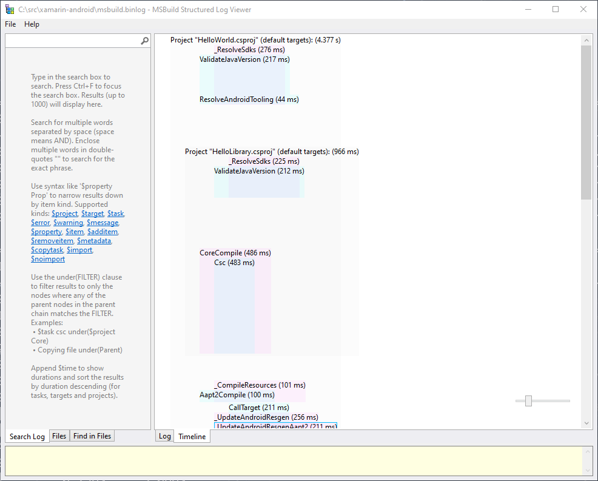

# Profiling Startup

There are currently a few different ways at getting timing information
from .NET for Android & Mono. This document aims to demystify the
command-line commands involved in retrieving this data from Android
devices.

This document explains many uses of `adb` at the command-line. On
Windows, you will need either `adb.exe` in your `%PATH%` or a
[powershell alias][set_alias] for `adb`.

[set_alias]: https://docs.microsoft.com/en-us/powershell/module/microsoft.powershell.utility/set-alias?view=powershell-6

## Overall Startup

The easiest way to time the complete time of startup is to launch the
app by tapping the icon, and run:

    # Windows / Powershell
    > adb logcat -d | Select-String Displayed

    # Mac / Unix
    > adb logcat -d | grep Displayed

_NOTE: going forward, I will just use `grep` in examples. On Windows, keep in mind to use `Select-String` if needed._

Both platforms will output something such as:

    09-04 14:33:32.466  1169  1192 I ActivityManager: Displayed com.xamarin.android.helloworld/example.MainActivity: +1s3ms

The `ActivityManager` system process logs how long it takes for any
Android activity to start. This is the best measure of overall time
taken: reflecting what a user experiences when launching the app.

You can also run `adb logcat -c` to clear the log at any point.

## Profiling the Runtime

Before launching the app, run the `adb` command:

    > adb shell setprop debug.mono.log timing=bare

After launching the app, we get additional information:

    > adb logcat -d | grep monodroid-timing
    09-04 14:44:11.968  9126  9126 I monodroid-timing: Runtime.init: Mono runtime init; elapsed: 0s:0::620209
    09-04 14:44:11.995  9126  9126 I monodroid-timing: Assembly load: HelloLibrary.dll preloaded; elapsed: 0s:1::92917
    09-04 14:44:11.995  9126  9126 I monodroid-timing: Finished loading assemblies: preloaded 2 assemblies; wasted time: 0s:1::111927
    09-04 14:44:12.026  9126  9126 I monodroid-timing: JNIEnv.Initialize start
    09-04 14:44:12.043  9126  9126 I monodroid-timing: JNIEnv.Initialize: Logger JIT/etc. time: elapsed 14 ms]
    09-04 14:44:12.192  9126  9126 I monodroid-timing: JNIEnv.Initialize: managed runtime init time: elapsed 148 ms]
    09-04 14:44:12.238  9126  9126 I monodroid-timing: TypeManager.cctor start: 1567626252195.41
    09-04 14:44:12.255  9126  9126 I monodroid-timing: TypeManager.cctor time: 1567626252254.66 [elapsed: 59.248 ms]
    09-04 14:44:12.255  9126  9126 I monodroid-timing: JNIEnv.Initialize: TypeManager init time: elapsed 63 ms]
    09-04 14:44:12.363  9126  9126 I monodroid-timing: JNIEnv.RegisterJniNatives ("Android.Runtime.UncaughtExceptionHandler, Mono.Android", 0x7fd311c2cc) start: 1567626252360.4
    09-04 14:44:12.420  9126  9126 I monodroid-timing: JNIEnv.RegisterJniNatives total time: 1567626252420.89 [elapsed: 60.492 ms]
    09-04 14:44:12.421  9126  9126 I monodroid-timing: Runtime.register: end time; elapsed: 0s:62::781621
    09-04 14:44:12.437  9126  9126 I monodroid-timing: JNIEnv.RegisterJniNatives ("Java.Interop.TypeManager+JavaTypeManager, Mono.Android, Version=0.0.0.0, Culture=neutral, PublicKeyToken=null", 0x7fd311b9ec) start: 1567626252437.71
    09-04 14:44:12.439  9126  9126 I monodroid-timing: JNIEnv.RegisterJniNatives total time: 1567626252439.4 [elapsed: 1.684 ms]
    09-04 14:44:12.439  9126  9126 I monodroid-timing: Runtime.register: end time; elapsed: 0s:1::757865
    09-04 14:44:12.446  9126  9126 I monodroid-timing: JNIEnv.Initialize end: elapsed 479 ms
    09-04 14:44:12.446  9126  9126 I monodroid-timing: Runtime.init: end native-to-managed transition; elapsed: 0s:443::816399
    09-04 14:44:12.446  9126  9126 I monodroid-timing: Runtime.init: end, total time; elapsed: 0s:480::702704
    09-04 14:44:12.459  9126  9126 I monodroid-timing: JNIEnv.RegisterJniNatives ("HelloWorld.MainActivity, HelloWorld", 0x7fd311ceec) start: 1567626252459.23
    09-04 14:44:12.470  9126  9126 I monodroid-timing: JNIEnv.RegisterJniNatives total time: 1567626252470.37 [elapsed: 11.144 ms]
    09-04 14:44:12.470  9126  9126 I monodroid-timing: Runtime.register: end time; elapsed: 0s:11::259949
    09-04 14:44:12.559  9126  9126 I monodroid-timing: JNIEnv.RegisterJniNatives ("Android.Views.View+IOnClickListenerImplementor, Mono.Android", 0x7fd311b5fc) start: 1567626252559.64
    09-04 14:44:12.561  9126  9126 I monodroid-timing: JNIEnv.RegisterJniNatives total time: 1567626252561.82 [elapsed: 2.182 ms]
    09-04 14:44:12.561  9126  9126 I monodroid-timing: Runtime.register: end time; elapsed: 0s:2::244636

These are timings taken at different points during .NET for Android
startup: across native and managed code.

In case you have the XA build tree by hand, it is possible to process
that information like:

    > msbuild /v:d build-tools/timing/timing.csproj /t:LogcatTiming /p:PID=3011  # process id of your application
    ...
    Task "ProcessLogcatTiming"
      Time:      0ms process start, application: '' PID: 3011
      Time:     57ms Message: Runtime.init: Mono runtime init; elapsed: 0s:0::44834
      Time:     65ms Message: Finished loading assemblies: preloaded 1 assemblies; wasted time: 0s:0::49
      Time:     73ms Message: JNIEnv.Initialize start
      Time:     78ms Message: JNIEnv.Initialize: Logger JIT/etc. time: elapsed 3 ms]
      Time:    101ms Message: JNIEnv.Initialize: managed runtime init time: elapsed 22 ms]
      Time:    113ms Message: TypeManager.cctor start: 1567669218343.18
      Time:    116ms Message: TypeManager.cctor time: 1567669218357.74 [elapsed: 14.563 ms]
      Time:    117ms Message: JNIEnv.Initialize: TypeManager init time: elapsed 15 ms]
      Time:    156ms Message: JNIEnv.RegisterJniNatives ("Android.Runtime.UncaughtExceptionHandler, Mono.Android", 0xffe3c454) start: 1567669218396.28
      Time:    163ms Message: JNIEnv.RegisterJniNatives total time: 1567669218404.38 [elapsed: 8.097 ms]
      Time:    163ms Message: Runtime.register: end time; elapsed: 0s:8::800097
      Time:    164ms Message: JNIEnv.RegisterJniNatives ("Java.Interop.TypeManager+JavaTypeManager, Mono.Android, Version=0.0.0.0, Culture=neutral, PublicKeyToken=null", 0xffe3bcf4) start: 1567669218405.08
      Time:    164ms Message: JNIEnv.RegisterJniNatives total time: 1567669218405.86 [elapsed: 0.787 ms]
      Time:    164ms Message: Runtime.register: end time; elapsed: 0s:0::813062
      Time:    166ms Message: JNIEnv.Initialize end: elapsed 105 ms
      Time:    166ms Message: JNIEnv.Initialize end: elapsed 105 ms
      Time:    166ms Message: Runtime.init: end native-to-managed transition; elapsed: 0s:100::17520
      Time:    166ms Message: Runtime.init: end native-to-managed transition; elapsed: 0s:100::17520
      Time:    166ms Message: Runtime.init: end, total time; elapsed: 0s:109::900001
      Time:    173ms Message: JNIEnv.RegisterJniNatives ("xatemplateaot.MainActivity, xatemplateaot", 0xffe3cbe4) start: 1567669218414.33
      Time:    173ms Message: JNIEnv.RegisterJniNatives total time: 1567669218414.89 [elapsed: 0.552 ms]
      Time:    173ms Message: Runtime.register: end time; elapsed: 0s:0::594434
      Time:    232ms Message: JNIEnv.RegisterJniNatives ("Android.Views.View+IOnClickListenerImplementor, Mono.Android", 0xffe3bb54) start: 1567669218473.37
      Time:    232ms Message: JNIEnv.RegisterJniNatives total time: 1567669218473.59 [elapsed: 0.219 ms]
      Time:    232ms Message: Runtime.register: end time; elapsed: 0s:0::241370
       -- Performance summary --
      Last timing message: 232ms
    Done executing task "ProcessLogcatTiming".
    ...

An example of these log messages would be [this managed
call][managed_timing] or [this native call][native_timing].

[managed_timing]: https://github.com/xamarin/xamarin-android/blob/faf2a3d7271e2e321b2fa500f85fa0f824abcf89/src/Mono.Android/Android.Runtime/JNIEnv.cs#L160
[native_timing]: https://github.com/xamarin/xamarin-android/blob/6be4bdbcfd9f2fbe6267aceb934394bcdd0f13b4/src/monodroid/jni/monodroid-glue.cc#L2062

## Profiling the AOT Compiler

The application needs to be built with embedded AOT profiler, the
profiler needs to be enabled and the application run on device or
emulator. That can be done by using `BuildAndStartAotProfiling`
target:

    > msbuild /t:BuildAndStartAotProfiling <your.csproj>

Related to that target is `$(AndroidAotProfilerPort)` property, which can
be used to choose the socket port number for communication with the
profiler. The default value is 9999.

Once the application starts, the `FinishAotProfiling` target can be
used to collect the profile from the device or emulator:

    > msbuild /t:FinishAotProfiling <your.csproj>

The `FinishAotProfiling` target uses the `$(AndroidAotProfilerPort)` for
socket port number and `$(AndroidAotCustomProfilePath)` for the newly
created profile file, the default value is `custom.aprof`.

The profile can be used to build your app with AOT profile. Add it to
the `@(AndroidAotProfile)` item group in your `.csproj` file and set the
`$(AndroidEnableProfiledAot)` property to `true`. You might also disable
the default AOT profile with `$(AndroidUseDefaultAotProfile)`
property. Part of your `.csproj` file might look like:

```xml
<ItemGroup>
  <AndroidAotProfile Include="$(MSBuildThisFileDirectory)custom.aprof" />
</ItemGroup>
<PropertyGroup>
  <AndroidEnableProfiledAot>true</AndroidEnableProfiledAot>
  <AndroidUseDefaultAotProfile>false</AndroidUseDefaultAotProfile>
</PropertyGroup>
```

The profile itself can be inspected and optionally filtered by the
[`aprofutil`][aprofutil] tool.

[aprofutil]: https://github.com/mono/mono/blob/2019-10/mcs/tools/aprofutil/README.md

Using the AOT profile is useful for scenarios like speeding up the
startup of your application or other performance critical parts, by
selectively AOT'ing only the methods included in the profile.

## Profiling the JIT Compiler

If profiling a Release build, you'll need to edit your
`AndroidManifest.xml` to make the application "debuggable":

```xml
<?xml version="1.0" encoding="utf-8"?>
<manifest xmlns:android="http://schemas.android.com/apk/res/android">
  <application android:debuggable="true" ...
```

Debug builds already set this value by default.

In order to save method JIT statistics, the application has to be built
with the `$(_AndroidMethodsStats)` MSBuild property set to `true`.

Next, run the `adb` command:

    > adb shell setprop debug.mono.log timing,default

After launching the app, wait for the desired period of time and then send
an Android intent to the application in order to actually save data into
the `methods.xml` file:

    > adb shell am broadcast -a mono.android.app.DUMP_TIMING_DATA com.xamarin.android.helloworld

After this is done, you can find a file that was recorded during startup:

    > adb shell run-as com.xamarin.android.helloworld ls files/.__override__
    methods.xml

Make sure to use your app's package name instead of `com.xamarin.android.helloworld`.

You can pull these files to your machine by doing:

    > adb shell run-as com.xamarin.android.helloworld cat files/.__override__/methods.xml > methods.xml

If you ever need to reset/clear these directories, you can
uninstall/reinstall the app or merely:

    > adb shell run-as com.xamarin.android.helloworld rm files/.__override__/methods.xml

`methods.xml` has the individual JIT times of each method:

    <method name="Java.Lang.Object:GetObject (intptr,Android.Runtime.JniHandleOwnership,System.Type)" invocation_count="1" jit_time="0:0::20915" jit_status="success" />

If methods statistics were gathered in `Release` mode, the `invocation_count` attribute of most entries
will be `0`.  This is due to the fact that the Mono runtime allows us to gather call statistics only
when running with the interpreter instead of JIT.  In order to properly count calls to each method, the
application needs to be built with the `$(UseInterpreter)` MSBuild property set to `true` (it works both in
`Debug` and `Release` modes).

This is not particularly readable, so you can use our
[jit-times][jit_times] command-line tool to get better/sorted output:

    # Windows / .NET
    jit-times.exe methods.xml > methods-sorted.txt

    # Mac / Mono
    mono jit-times.exe methods.xml > methods-sorted.txt

Which outputs:

| Total (ms) |  Self (ms) | Method |
| --:        | --:        | --     |
|      20.08 |      20.08 | System.Reflection.Emit.OpCodes:.cctor () |
|      23.29 |      19.61 | Java.Interop.JniRuntime:.ctor (Java.Interop.JniRuntime/CreationOptions) |
|       9.34 |       8.59 | Android.Runtime.JNIEnv:Initialize (Android.Runtime.JnienvInitializeArgs*) |
|       5.74 |       5.74 | string:SplitInternal (string,string[],int,System.StringSplitOptions) |
|       5.17 |       5.17 | System.Text.StringBuilder:AppendFormatHelper (System.IFormatProvider,string,System.ParamsArray) |
|       4.74 |       4.74 | Java.Interop.JniRuntime:InitJniBuiltinTypeNameMappings () |
|       4.60 |       4.60 | Java.Interop.JniRuntime:InitJniBuiltinArrayMappings () |
|       4.41 |       4.41 | Java.Interop.JniRuntime/JniTypeManager/<CreateGetTypeSignaturesEnumerator>d__11:MoveNext () |
|       4.25 |       4.07 | System.MonoCustomAttrs:GetCustomAttributes (System.Reflection.ICustomAttributeProvider,System.Type,bool) |
|      24.31 |       3.92 | Android.Runtime.JNINativeWrapper:CreateDelegate (System.Delegate) |
|      19.64 |       3.79 | Java.Lang.Thread:get_DefaultUncaughtExceptionHandler () |

For further details see [jit-times' README.md][jit_times].

[jit_times]: ../../tools/jit-times/README.md

## Profiling Managed Code

Before launching the app, you can enable Mono profiling via:

    > adb shell setprop debug.mono.profile log:calls

Anything after `debug.mono.profile` is the `--profile` switch
described on the [Mono documentation][mono_docs].

Now when launching the app, you get a new file:

    > adb shell run-as com.xamarin.android.helloworld ls files/.__override__
    profile.mlpd

This `profile.mlpd` file is a binary file, so we can't just pipe it to
a file with `>`. I used a known writeable directory on my device such
as `/sdcard/Download/`:

    > adb shell run-as com.xamarin.android.helloworld cp files/.__override__/profile.mlpd /sdcard/Download/
    > adb pull /sdcard/Download/profile.mlpd
    /sdcard/Download/profile.mlpd: 1 file pulled. 24.8 MB/s (823327 bytes in 0.032s)

To view this file in a readable format, you can use `mprof-report`:

    $ mprof-report profile.mlpd > profile.txt

_NOTE: on Windows, I used `mprof-report` from WSL/bash, since it appears to not be distributed in the Mono Windows installer._

Your output will be something like:

```
Mono log profiler data
	Profiler version: 3.0
	Data version: 17
	Arguments: log:calls,output=/data/user/0/com.xamarin.android.helloworld/files/.__override__/profile.mlpd
	Architecture: armv8
	Operating system: linux
	Mean timer overhead: 47 nanoseconds
	Program startup: Wed Sep  4 10:46:50 2019
	Program ID: 11929
	Server listening on: 44657

JIT summary
	Compiled methods: 1454
	Generated code size: 459916
	JIT helpers: 0
	JIT helpers code size: 0

GC summary
	GC resizes: 0
	Max heap size: 0
	Object moves: 0

Method call summary
Total(ms) Self(ms)      Calls Method name
     465        0          1 (wrapper runtime-invoke) <Module>:runtime_invoke_void_JnienvInitializeArgs* (object,intptr,intptr,intptr)
     465        9          1 Android.Runtime.JNIEnv:Initialize (Android.Runtime.JnienvInitializeArgs*)
     171        0          3 (wrapper native-to-managed) Android.Runtime.DynamicMethodNameCounter:3 (intptr,intptr,intptr)
     171        0          3 (wrapper dynamic-method) Android.Runtime.DynamicMethodNameCounter:3 (intptr,intptr,intptr)
     170        2          3 Android.App.Activity:n_OnCreate_Landroid_os_Bundle_ (intptr,intptr,intptr)
     162        6          1 Android.Runtime.AndroidRuntime:.ctor (intptr,intptr,bool,intptr,intptr)
     153        2          3 HelloWorld.MainActivity:OnCreate (Android.OS.Bundle)
     147        0         21 (wrapper runtime-invoke) object:runtime_invoke_void (object,intptr,intptr,intptr)
     132        1         14 Java.Interop.JniPeerMembers:.ctor (string,System.Type)
     124        0          8 (wrapper runtime-invoke) object:runtime_invoke_void (object,intptr,intptr,intptr)
     117        7          1 Java.Interop.JniRuntime:.ctor (Java.Interop.JniRuntime/CreationOptions)
     106        6         14 Java.Interop.JniPeerMembers:.ctor (string,System.Type,bool,bool)
     105        0         57 Java.Interop.JniRuntime/JniTypeManager:GetTypeSignature (System.Type)
     100        0          4 (wrapper runtime-invoke) <Module>:runtime_invoke_void_intptr_int_intptr_intptr_int (object,intptr,intptr,intptr)
     100        2          4 Android.Runtime.JNIEnv:RegisterJniNatives (intptr,int,intptr,intptr,int)
      99        1         57 System.Linq.Enumerable:FirstOrDefault<Java.Interop.JniTypeSignature> (System.Collections.Generic.IEnumerable`1<Java.Interop.JniTypeSignature>)
      99        0         10 Java.Interop.JniEnvironment/InstanceMethods:CallNonvirtualVoidMethod (Java.Interop.JniObjectReference,Java.Interop.JniObjectReference,Java.Interop.JniMethodInfo,Java.Interop.JniArgumentValue*)
      98        5         57 System.Linq.Enumerable:TryGetFirst<Java.Interop.JniTypeSignature> (System.Collections.Generic.IEnumerable`1<Java.Interop.JniTypeSignature>,bool&)
```

Note: the times in the method call summary above include the time to
JIT the method. The JIT time can be significant, for methods which are
called just once it can be 50% of that time for example.

[mono_docs]: https://www.mono-project.com/docs/debug+profile/profile/profiler/#profiler-option-documentation

## Profiling Native Code

[simpleperf][simpleperf] is a tool included with the Android NDK for
profiling native code.

If using the Visual Studio installation, you find this tool in
`C:\Program Files (x86)\Android\android-sdk\ndk-bundle\simpleperf`.
It also requires an installation of python.

Step 1, you will need to setup a shell script inside your app. You
will take these files:

* `C:\Program Files (x86)\Android\android-sdk\ndk-bundle\wrap.sh\asan.arm64-v8a.sh`
* `C:\Program Files (x86)\Android\android-sdk\ndk-bundle\wrap.sh\asan.armeabi-v7a.sh`
* `C:\Program Files (x86)\Android\android-sdk\ndk-bundle\wrap.sh\asan.x86.sh`
* `C:\Program Files (x86)\Android\android-sdk\ndk-bundle\wrap.sh\asan.x86_64.sh`

You will need to place these files inside your app as `AndroidAsset`,
renamed to these paths:

* `Assets\lib\arm64-v8a\wrap.sh`
* `Assets\lib\armeabi-v7a\wrap.sh`
* `Assets\lib\x86\wrap.sh`
* `Assets\lib\x86_64\wrap.sh`

If you plan on profiling on a single device, I would only do this for
the single ABI you need.

To profile app startup, I was running the command:

    python app_profiler.py -p com.yourcompany.yourapp -a yourpackage.MainActivity

* `app_profiler.py` is `"C:\Program Files (x86)\Android\android-sdk\ndk-bundle\simpleperf\app_profiler.py"`
* You might additionally need `--ndk_path="C:\Program Files (x86)\Android\android-sdk\ndk-bundle\simpleperf"`

This generates a bunch of files in the current directory, such as:
`binary_cache\`, `perf.data`, and `perf.report`.

To view the results, run commands such as:

```
> python report.py
Cmdline: /data/data/Xamarin.Forms_Performance_Integration/simpleperf record --in-app --tracepoint-events /data/local/tmp/tracepoint_events -o perf.data -e task-clock:u -f 1000 -g --duration 10 --symfs /data/local/tmp/native_libs/ --app Xamarin.Forms_Performance_Integration
Arch: x86
Event: task-clock:u (type 1, config 1)
Samples: 1558
Event count: 1558000000

Overhead  Command                                Pid   Tid   Shared Object                                                                                  Symbol
97.88%    Xamarin.Forms_Performance_Integration  6527  6527  [vdso]                                                                                         __vdso_clock_gettime
0.13%     RenderThread                           6527  6548  [vdso]                                                                                         __vdso_clock_gettime
0.13%     Xamarin.Forms_Performance_Integration  6527  6527  /system/lib/libdexfile.so                                                                      art::IsValidPartOfMemberNameUtf8(char const**)
0.06%     Binder:6527_3                          6527  6542  [vdso]                                                                                         __vdso_clock_gettime
0.06%     Jit thread pool                        6527  6533  [vdso]                                                                                         __vdso_clock_gettime
0.06%     Xamarin.Forms_Performance_Integration  6527  6527  /data/app/Mono.Android.DebugRuntime-wbwmv22rlkqD4wNWY5gjpQ==/lib/x86/libmonosgen-32bit-2.0.so  libmonosgen-32bit-2.0.so[+21bf4c]
0.06%     Xamarin.Forms_Performance_Integration  6527  6527  /data/app/Mono.Android.DebugRuntime-wbwmv22rlkqD4wNWY5gjpQ==/lib/x86/libmonosgen-32bit-2.0.so  libmonosgen-32bit-2.0.so[+23ddf9]
...
```

Or some other examples:

```
> python report.py --sort dso
Cmdline: /data/data/Xamarin.Forms_Performance_Integration/simpleperf record --in-app --tracepoint-events /data/local/tmp/tracepoint_events -o perf.data -e task-clock:u -f 1000 -g --duration 10 --symfs /data/local/tmp/native_libs/ --app Xamarin.Forms_Performance_Integration
Arch: x86
Event: task-clock:u (type 1, config 1)
Samples: 1558
Event count: 1558000000

Overhead  Shared Object
98.14%    [vdso]
0.71%     /system/lib/libart.so
0.58%     /data/app/Mono.Android.DebugRuntime-wbwmv22rlkqD4wNWY5gjpQ==/lib/x86/libmonosgen-32bit-2.0.so
0.32%     /system/lib/libdexfile.so
0.19%     /system/lib/libc.so
0.06%     /system/lib/libandroidfw.so
```

Or to get a full tree with a GUI:

    > python report.py -g --gui

See further details on `simpleperf`'s [README][simpleperf-readme].

[simpleperf]: https://developer.android.com/ndk/guides/simpleperf
[simpleperf-readme]: https://android.googlesource.com/platform/system/extras/+/master/simpleperf/doc/README.md

# Profiling MSBuild

At a high level, you can get a performance summary from MSBuild via:

    > msbuild YourProject.csproj /clp:performancesummary

This prints out a breakdown for evaluation, and every MSBuild task &
target:

    Project Evaluation Performance Summary:
           12 ms  samples\HelloWorld\HelloLibrary\HelloLibrary.csproj   1 calls
           98 ms  samples\HelloWorld\HelloWorld.csproj   1 calls

    Target Performance Summary:
          275 ms  _UpdateAndroidResgen                       2 calls
          354 ms  _GenerateJavaStubs                         1 calls
          665 ms  _CompileJava                               1 calls
          684 ms  CoreCompile                                2 calls
          865 ms  _ResolveSdks                               2 calls
          953 ms  ResolveProjectReferences                   2 calls
         1219 ms  _CompileToDalvikWithD8                     1 calls

    Task Performance Summary:
          681 ms  Csc                                        2 calls
          809 ms  ValidateJavaVersion                        2 calls
          983 ms  MSBuild                                    5 calls
         1217 ms  D8                                         1 calls

Depending on what you're looking for, the MSBuild target timings may
be the most useful. `<MSBuild/>` or `<CallTarget/>` task calls can be
misleading, because they merely invoke other targets and don't spend
much time themselves.

See the [MSBuild documentation][msbuild_cmd] for details about
`/clp:performancesummary`.

[msbuild_cmd]: https://docs.microsoft.com/visualstudio/msbuild/msbuild-command-line-reference

## MSBuild Binary Logs

Using MSBuild binary logs is helpful for performance profiling, as
well as general MSBuild "debugging". You can generate a binary log with:

    > msbuild YourProject.csproj /bl

This will generate a `msbuild.binlog` file in the current directory
you can open with the [MSBuild Binary Log Viewer][msbuildlog].

In addition to showing you absolutely *everything* about the build, it
can show the top 10 most expensive tasks:

    Top 10 most expensive tasks
        D8 = 3.895 s
        AndroidApkSigner = 2.555 s
        BuildApk = 2.396 s
        Javac = 2.060 s
        ResolveLibraryProjectImports = 1.246 s
        LinkAssembliesNoShrink = 840 ms
        CallTarget = 814 ms
        Aapt2Link = 812 ms
        Exec = 657 ms
        Aapt2Compile = 623 ms

It also has a timeline view:



[msbuildlog]: http://msbuildlog.com/
[msbuild_bl]: https://github.com/microsoft/msbuild/blob/master/documentation/wiki/Binary-Log.md

## MSBuild Profiling in IDEs

For Visual Studio on Windows, you can use the [Project System
Tools][projectsystemtools] extension for recording `.binlog` files.
This is extremely useful, as you can get logs for IDE-specific builds,
such as design-time builds or builds related to the Android designer.

In Visual Studio for Mac, the only option for measuring build times at
the moment is to enable [diagnostic build logging][diagnostic].
Diagnostic logging includes the results of `/clp:performancesummary`
in the build output window.

> Important! Using diagnostic MSBuild logging slows down the build
> quite a bit! Even a "short" build with no changes can take as much
> as 3X longer! Keep that in mind while profiling.

[projectsystemtools]: https://marketplace.visualstudio.com/items?itemName=VisualStudioProductTeam.ProjectSystemTools
[diagnostic]: https://docs.microsoft.com/xamarin/android/troubleshooting/troubleshooting#diagnostic-msbuild-output
