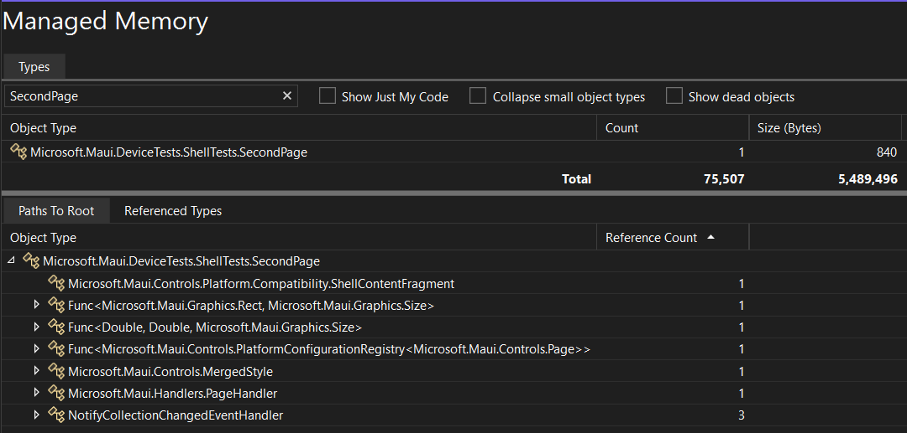

# Using a device connected via USB

## Startup profiling
### Set up reverse port forwarding:

Note that you can skip this step if the Android application is running on an
Android emulator; it is only required for physical Android devices.

```sh
$ adb reverse tcp:9000 tcp:9001
```
This will forward port 9000 on device to port 9001.

_Alternatively:_
```sh
$ adb reverse tcp:0 tcp:9001
43399
```
This will allocate a random port on remote and forward it to port 9001 on the host. The forwarded port is printed by adb

### Install `dotnet-dsrouter`

Generally, you can use a stable `dotnet-dsrouter` from NuGet:

```sh
$ dotnet tool install -g dotnet-dsrouter
You can invoke the tool using the following command: dotnet-dsrouter
Tool 'dotnet-dsrouter' was successfully installed.
```

Or use a build from the nightly feed `https://aka.ms/dotnet-tools/index.json`:

```sh
$ dotnet tool install -g dotnet-dsrouter --add-source=https://aka.ms/dotnet-tools/index.json --prerelease
```

### Start the tracing router/proxy on host

For profiling an Android application running on an Android _emulator_:
```sh
$ dotnet-dsrouter android-emu
How to connect current dotnet-dsrouter pid=1234 with android emulator and diagnostics tooling.
Start an application on android emulator with ONE of the following environment variables set:
[Default Tracing]
DOTNET_DiagnosticPorts=10.0.2.2:9000,nosuspend,connect
[Startup Tracing]
DOTNET_DiagnosticPorts=10.0.2.2:9000,suspend,connect
Run diagnotic tool connecting application on android emulator through dotnet-dsrouter pid=1234:
dotnet-trace collect -p 1234
See https://learn.microsoft.com/en-us/dotnet/core/diagnostics/dotnet-dsrouter for additional details and examples.

info: dotnet-dsrouter-1234[0]
      Starting dotnet-dsrouter using pid=1234
info: dotnet-dsrouter-1234[0]
      Starting IPC server (dotnet-diagnostic-dsrouter-1234) <--> TCP server (127.0.0.1:9000) router.
```

For profiling an Android application running on an Android _device_:

```sh
# `adb reverse` is required when using hardware devices
$ adb reverse tcp:9000 tcp:9001
$ dotnet-dsrouter android
How to connect current dotnet-dsrouter pid=1234 with android device and diagnostics tooling.
Start an application on android device with ONE of the following environment variables set:
[Default Tracing]
DOTNET_DiagnosticPorts=127.0.0.1:9000,nosuspend,connect
[Startup Tracing]
DOTNET_DiagnosticPorts=127.0.0.1:9000,suspend,connect
Run diagnotic tool connecting application on android device through dotnet-dsrouter pid=1234:
dotnet-trace collect -p 1234
...
```

### Configure the device so that the profiled app suspends until tracing utility connects

Note the log message that `dotnet-dsrouter` prints that mentions
`$DOTNET_DiagnosticPorts`. `$DOTNET_DiagnosticPorts` is an environment
variable that could be defined in an `@(AndroidEnvironment)`, but it
is simpler to use the `debug.mono.profile` Android system property.
Android system properties can be used without rebuilding the app.

Based on the value `dotnet-dsrouter` logs for
`DOTNET_DiagnosticPorts`, choose one of:

```sh
# Emulators will be 10.x.x.x
$ adb shell setprop debug.mono.profile '10.0.2.2:9000,suspend,connect'
# Devices will be 127.0.0.1, but require `adb reverse` as mentioned above
$ adb shell setprop debug.mono.profile '127.0.0.1:9000,suspend,connect'
```

`suspend` is useful as it blocks application startup, so you can
actually `dotnet-trace` startup times of the application.

If you are wanting to collect a `gcdump` or just get things working,
try `nosuspend` instead.

### Start the tracing client

First, run `dotnet-trace ps` to find a list of processes:

```
> dotnet-trace ps
 38604  dotnet-dsrouter  C:\Users\myuser\.dotnet\tools\dotnet-dsrouter.exe  "C:\Users\myuser\.dotnet\tools\dotnet-dsrouter.exe" android-emu --verbose debug
```

`dotnet-trace` knows how to tell if a process ID is `dotnet-dsrouter` and
connect *through it* appropriately.

Using the process ID from the previous step, run `dotnet-trace collect`:

```
$ dotnet-trace collect -p 38604 --format speedscope
No profile or providers specified, defaulting to trace profile 'cpu-sampling'

Provider Name                           Keywords            Level               Enabled By
Microsoft-DotNETCore-SampleProfiler     0x0000F00000000000  Informational(4)    --profile 
Microsoft-Windows-DotNETRuntime         0x00000014C14FCCBD  Informational(4)    --profile 

Waiting for connection on /tmp/maui-app
Start an application with the following environment variable: DOTNET_DiagnosticPorts=/tmp/maui-app
```

The `--format` argument is optional and it defaults to `nettrace`. However, `nettrace` files can be viewed only with
Perfview on Windows, while the speedscope JSON files can be viewed "on" Unix by uploading them to https://speedscope.app

### Compile and run the application

`$(AndroidEnableProfiler)` must be set to `true` as it includes the
Mono diagnostic component in the application. This component is the
`libmono-component-diagnostics_tracing.so` native library.

```
$ dotnet build -f net8.0-android -t:Run -c Release -p:AndroidEnableProfiler=true
```
_NOTE: `-f net8.0-android` is only needed for projects with multiple `$(TargetFrameworks)`._

Once the application is installed and started, `dotnet-trace` should show something similar to:

```
Process        : $HOME/.dotnet/tools/dotnet-dsrouter
Output File    : /tmp/hellomaui-app-trace
[00:00:00:35]	Recording trace 1.7997   (MB)
Press <Enter> or <Ctrl+C> to exit...812  (KB)
```

Once `<Enter>` is pressed, you should see:

```
Stopping the trace. This may take up to minutes depending on the application being traced.

Trace completed.
Writing:	hellomaui-app-trace.speedscope.json
```

And the output files should be found in the current directory. You can
use the `-o` switch if you would prefer to output them to a specific
directory.

## How to get GC memory dumps?

If running on desktop, you can use the `dotnet-gcdump` global tool.
This can be installed via:

```dotnetcli
$ dotnet tool install --global dotnet-gcdump
```

To use it, for example:

```sh
# `hw-readline` is a standard Hello World, with a `Console.ReadLine()` at the end
$ dotnet run --project hw-readline.csproj
Hello, World!
Press <ENTER> to continue

# Then from another shell...

# Determine which process ID to dump
$ dotnet-gcdump ps
33972  hw-readline  /path/to/hw-readline/bin/Debug/hw-readline

# Collect the GC info
$ dotnet-gcdump collect -p 33972
Writing gcdump to '.../hw-readline/20230314_113922_33972.gcdump'...
	Finished writing 5624131 bytes.
```
See the [`dotnet-gcdump` documentation][dotnet-gcdump]
for further details about its usage.

This will connect to a process and save a `*.gcdump` file. You can
open this file in Visual Studio on Windows, for example:



## Memory Dumps for Android in .NET 8+

In .NET 8, we have a simplified method for collecing `*.gcdump` files for
Android applications. To get this data from an Android application, you need all
the above setup for `adb shell`, `dsrouter`, etc. except you need to simply use
`dotnet-gcdump` instead of `dotnet-trace`:

```sh
$ dotnet-gcdump collect -p 38604
```

This will create a `*.gcdump` file in the current directory.

Note that using `nosuspend` in the `debug.mono.profile` property is
useful, as it won't block application startup.

## Memory Dumps for Android in .NET 7

In .NET 7, we have to use th older, more complicated method for collecting
`*.gcdump` files for Android applications. To get this data from an Android
application, you need all the above setup for `adb shell`, `dsrouter`, etc.

```sh
$ dotnet-trace collect --diagnostic-port /tmp/maui-app --providers Microsoft-DotNETRuntimeMonoProfiler:0xC900001:4
```

`0xC900001`, a bitmask, enables the following event types:

* `GCKeyword`
* `GCHeapCollectKeyword`
* `GCRootKeyword`

See the [`Microsoft-DotNETRuntimeMonoProfiler` event types][mono-events] for more info.

`:4` enables "Informational" verbosity, where the different logging
levels are described by [`dotnet-trace help` output][dotnet-trace-help].

This saves a `.nettrace` file with GC events that are not available
with the default provider.

To actually view this data, you'll have to use one of:

* https://github.com/lateralusX/diagnostics-nettrace-samples
* https://github.com/filipnavara/mono-gcdump

Using `mono-gcdump`:

```sh
$ dotnet run --project path/to/filipnavara/mono-gcdump/mono-gcdump.csproj -- convert foo.nettrace
```

This saves a `foo.gcdump` that you can open in Visual Studio.

See the [dotnet/runtime documentation][gc-dumps-on-mono] for
additional details.

[dotnet-gcdump]: https://learn.microsoft.com/dotnet/core/diagnostics/dotnet-gcdump
[mono-events]: https://github.com/dotnet/runtime/blob/c887c92d8af4ce65b19962b777f96ae8eb997a42/src/coreclr/vm/ClrEtwAll.man#L7433-L7468
[dotnet-trace-help]: https://github.com/dotnet/diagnostics/blob/6d755e8b5435b1380c118e9d81e075654b0330c9/documentation/dotnet-trace-instructions.md#dotnet-trace-help
[gc-dumps-on-mono]: https://github.com/dotnet/runtime/blob/728fd85bc7ad04f5a0ea2ad0d4d8afe371ff9b64/docs/design/mono/diagnostics-tracing.md#collect-gc-dumps-on-monovm

## How to `dotnet trace` our build?

Setting this up is easy, the main issue is there end up being
potentially *a lot* of threads (30-40) depending on the build.

Before getting started, I would recommend doing these things to make
the trace smaller and easier to understand:

* Set `$DOTNET_CLI_TELEMETRY_OPTOUT` to `1`, to avoid any dotnet CLI
  telemetry in the trace.
* Profile a single `.csproj` build, not a `.sln`. This keeps
  the build in-process.
* Always `restore` in a separate step and use `--no-restore` when you
  trace. This avoids NuGet logic in the trace.
* Save a `.binlog`, so you can review that the build actually did what
  you expected. `dotnet trace` tends to hide all the console output.

So, for example, to profile a build:

```dotnetcli
dotnet restore foo.csproj
dotnet trace collect --format speedscope -- dotnet build -bl --no-restore foo.csproj
```

This should result in `.speedscope` and `.nettrace` files in the
current directory.

If you wanted to profile deploy & app launch, do a build first:

```dotnetcli
dotnet build foo.csproj
dotnet trace collect --format speedscope -- dotnet build "-t:Run" -bl --no-restore foo.csproj
```

I found that `"` is necessary when `:` characters are present in the
command. This appears to be some kind of argument parsing issue with
`dotnet trace`.
