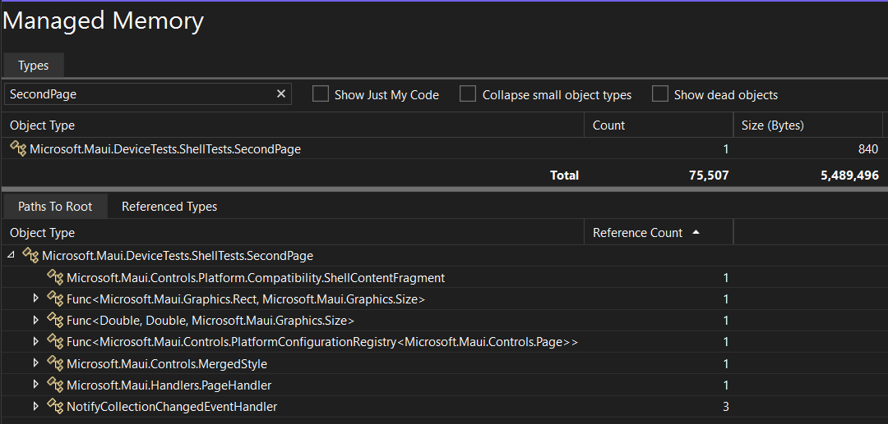

# Tracing .NET for Android Applications

Attaching `dotnet-trace` to a .NET for Android application allows you to get
profiling information in formats like `.nettrace` and `.speedscope`. These
give you CPU sampling information about the time spent in each method in your
application. This is useful for finding *where* time is spent during startup
or general application execution.

The workflow in this section is for CoreCLR applications in .NET 11 and later.
CoreCLR EventPipe diagnostics use the runtime diagnostic server and configured
TCP diagnostic ports. MonoVM applications retain the historical
`debug.mono.profile` and Mono diagnostic-component guidance described later
in this page.

To use `dotnet-trace` on Android, the following tools/components work
together to make this happen:

* [`dotnet-trace`][dotnet-trace] itself is a .NET global tool.

* [`dotnet-dsrouter`][dotnet-dsrouter] is a .NET global tool that
  forwards a connection from a remote Android or iOS device or
  emulator to a local port on your development machine.

* [`dotnet-gcdump`][dotnet-gcdump] is a .NET global tool that can be
  used to collect memory dumps of .NET applications.

* The Mono Diagnostic component, `libmono-component-diagnostics_tracing.so`,
  is included in MonoVM applications and is used to collect the trace data.

* CoreCLR's EventPipe diagnostic server is included in .NET 11 and later
  applications and communicates with the diagnostic tools through
  `dotnet-dsrouter`.

> **NOTE:** Use current releases of the diagnostic tools. The .NET 11 RC1
> SDK is the validation baseline for the workflow described here. Check
> [dotnet-trace](https://www.nuget.org/packages/dotnet-trace/),
> [dotnet-dsrouter](https://www.nuget.org/packages/dotnet-dsrouter/),
> and [dotnet-gcdump](https://www.nuget.org/packages/dotnet-gcdump/)
> on NuGet for the latest versions.

See the [`dotnet-trace` documentation][dotnet-trace] for further details about its usage.

[dotnet-trace]: https://learn.microsoft.com/dotnet/core/diagnostics/dotnet-trace
[dotnet-dsrouter]: https://learn.microsoft.com/dotnet/core/diagnostics/dotnet-dsrouter
[dotnet-gcdump]: https://learn.microsoft.com/dotnet/core/diagnostics/dotnet-gcdump

## Install .NET Global Tools

Generally, you can install the required tooling such as:

```sh
$ dotnet tool install -g dotnet-trace
You can invoke the tool using the following command: dotnet-trace
Tool 'dotnet-trace' was successfully installed.
$ dotnet tool install -g dotnet-dsrouter
You can invoke the tool using the following command: dotnet-dsrouter
Tool 'dotnet-dsrouter' was successfully installed.
$ dotnet tool install -g dotnet-gcdump
You can invoke the tool using the following command: dotnet-gcdump
Tool 'dotnet-gcdump' was successfully installed.
```

You can also install prerelease builds from the nightly feed
`https://aka.ms/dotnet-tools/index.json`:

```sh
$ dotnet tool install -g dotnet-trace --add-source=https://aka.ms/dotnet-tools/index.json --prerelease
You can invoke the tool using the following command: dotnet-trace
Tool 'dotnet-trace' was successfully installed.
```

## Quickstart (CoreCLR on an Android device)
**Do not run the app through Visual Studio**, the app freezes on the splash screen.

The following commands collect a GC memory dump from a CoreCLR application.
The same diagnostic-port connection can be used with `dotnet-trace`.

1. Start the forwarding router:
   `dotnet-dsrouter server-server --tcp-server 127.0.0.1:9000 --forward-port Android`
2. Build, install, and start the application on the device:
   `dotnet build -t:Run -c Release -p:EnableDiagnostics=true .\MyApp.csproj`
3. Run `dotnet-gcdump ps` to find the router process.
4. Run `dotnet-gcdump collect -p PID`.

`EnableDiagnostics` is an Android SDK/MSBuild property. It is distinct from
the `DOTNET_EnableDiagnostics` runtime environment variable. The build
properties configure `DOTNET_DiagnosticPorts`; they do not use
`debug.dotnet.profile` as the primary CoreCLR port configuration.

This creates a `.gcdump` file that you can open in Visual Studio.

## Configuration & Setup

### Using `dotnet-trace` with the `--dsrouter` option

Starting with version 9.0.621003, `dotnet-trace` includes a
`--dsrouter` option that eliminates the need to run `dotnet-dsrouter`
separately. This simplifies the workflow significantly.

For Android emulators:

```sh
$ dotnet-trace collect --dsrouter android-emu --format speedscope
WARNING: dotnet-dsrouter is a development tool not intended for production environments.
For finer control over the dotnet-dsrouter options, run it separately and connect to it using -p

No profile or providers specified, defaulting to trace profile 'cpu-sampling'

Provider Name                           Keywords            Level               Enabled By
Microsoft-DotNETCore-SampleProfiler     0x0000F00000000000  Informational(4)    --profile
Microsoft-Windows-DotNETRuntime         0x00000014C14FCCBD  Informational(4)    --profile
```

For Android devices:

```sh
# `adb reverse` is still required when using hardware devices
$ adb reverse tcp:9000 tcp:9001
$ dotnet-trace collect --dsrouter android --format speedscope
WARNING: dotnet-dsrouter is a development tool not intended for production environments.
For finer control over the dotnet-dsrouter options, run it separately and connect to it using -p

No profile or providers specified, defaulting to trace profile 'cpu-sampling'

Provider Name                           Keywords            Level               Enabled By
Microsoft-DotNETCore-SampleProfiler     0x0000F00000000000  Informational(4)    --profile
Microsoft-Windows-DotNETRuntime         0x00000014C14FCCBD  Informational(4)    --profile
```

The `--format` argument is optional and it defaults to `nettrace`.
However, `nettrace` files can be viewed only with Perfview or Visual
Studio on Windows, while the speedscope JSON files can be viewed "on"
Unix by opening them with [https://speedscope.app/][speedscope].

[speedscope]: https://speedscope.app/

### Running `dotnet-dsrouter` Separately

Running `dotnet-dsrouter` separately provides finer control over its
options and can be useful for viewing its log messages when troubleshooting.
The examples below use `connect` mode: the application connects to the
router's TCP endpoint, and the diagnostic tool connects to the router's local
IPC endpoint. Start the router before launching an application configured with
`DiagnosticSuspend=true`; otherwise the application waits for a connection
that does not yet exist. Use `DiagnosticSuspend=false` when the application
should start before a tool attaches.

For profiling an Android application running on an Android *emulator*:

```sh
$ dotnet-dsrouter server-server --tcp-server 127.0.0.1:9000
How to connect current dotnet-dsrouter pid=1234 with android emulator and diagnostics tooling.
Build and run your application on android emulator such as:
[Default Tracing]
dotnet build -t:Run -c Release -p:DiagnosticAddress=10.0.2.2 -p:DiagnosticPort=9000 -p:DiagnosticSuspend=false -p:DiagnosticListenMode=connect
[Startup Tracing]
dotnet build -t:Run -c Release -p:DiagnosticAddress=10.0.2.2 -p:DiagnosticPort=9000 -p:DiagnosticSuspend=true -p:DiagnosticListenMode=connect
Run diagnostic tool connecting application on android emulator through dotnet-dsrouter pid=1234:
dotnet-trace collect -p 1234
See https://learn.microsoft.com/dotnet/core/diagnostics/dotnet-dsrouter for additional details and examples.

info: dotnet-dsrouter-1234[0]
      Starting dotnet-dsrouter using pid=1234
info: dotnet-dsrouter-1234[0]
      Starting IPC server (dotnet-diagnostic-dsrouter-1234) <--> TCP server (127.0.0.1:9000) router.
```

For profiling an Android application running on an Android *device*:

```sh
$ dotnet-dsrouter server-server --tcp-server 127.0.0.1:9000 --forward-port Android
How to connect current dotnet-dsrouter pid=1234 with android device and diagnostics tooling.
Build and run your application on android device such as:
[Default Tracing]
dotnet build -t:Run -c Release -p:DiagnosticAddress=127.0.0.1 -p:DiagnosticPort=9000 -p:DiagnosticSuspend=false -p:DiagnosticListenMode=connect
[Startup Tracing]
dotnet build -t:Run -c Release -p:DiagnosticAddress=127.0.0.1 -p:DiagnosticPort=9000 -p:DiagnosticSuspend=true -p:DiagnosticListenMode=connect
Run diagnostic tool connecting application on android device through dotnet-dsrouter pid=1234:
dotnet-trace collect -p 1234
...
```

Bind the host-side router endpoint to a loopback interface. For an Android
emulator, `10.0.2.2` is the emulator alias for the host loopback; for a
physical device, use `127.0.0.1` with Android port forwarding. Diagnostic TCP
endpoints are unauthenticated and unencrypted development interfaces and must
remain local.

### Android System Properties

The `$(DiagnosticAddress)`, `$(DiagnosticPort)`, `$(DiagnosticSuspend)`,
and `$(DiagnosticListenMode)` MSBuild properties configure the
`DOTNET_DiagnosticPorts` environment variable packaged in the application.
`$(DiagnosticConfiguration)` can be used to provide the complete value.
Nonempty `Diagnostic*` settings implicitly enable Android diagnostics when
`$(AndroidEnableProfiler)` is not explicitly set to `false`.

For CoreCLR, these MSBuild properties are the primary diagnostic-port
configuration. `debug.dotnet.profile` is not a diagnostic-port setting; its
presence is used by current runtime diagnostic-output-directory behavior.
`DOTNET_EnableDiagnostics` is a separate CoreCLR runtime environment variable
that controls whether diagnostics are enabled at runtime.

For emulators, `DOTNET_DiagnosticPorts` should specify an IP address
of 10.0.2.2:

```sh
$ dotnet build -t:Run -c Release -p:DiagnosticAddress=10.0.2.2 -p:DiagnosticPort=9000 -p:DiagnosticSuspend=true -p:DiagnosticListenMode=connect
```

For devices, `DOTNET_DiagnosticPorts` should specify an IP address of
127.0.0.1. `dotnet-dsrouter server-server` with Android port forwarding
establishes the device connection:

```sh
$ dotnet-dsrouter server-server --tcp-server 127.0.0.1:9000 --forward-port Android
$ dotnet build -t:Run -c Release -p:DiagnosticAddress=127.0.0.1 -p:DiagnosticPort=9000 -p:DiagnosticSuspend=true -p:DiagnosticListenMode=connect
```

`suspend` is useful as it blocks application startup, so you can
actually `dotnet-trace` startup times of the application.

If you are wanting to collect a `gcdump` or just get things working,
use `-p:DiagnosticSuspend=false` instead. See the [`dotnet-dsrouter`
documentation][nosuspend] for further information.

[nosuspend]: https://learn.microsoft.com/dotnet/core/diagnostics/dotnet-dsrouter#collect-a-trace-using-dotnet-trace-from-a-net-application-running-on-android

### Running `dotnet-trace` on the Host

First, run `dotnet-trace ps` to find a list of processes:

```sh
> dotnet-trace ps
 38604  dotnet-dsrouter  C:\Users\myuser\.dotnet\tools\dotnet-dsrouter.exe  "C:\Users\myuser\.dotnet\tools\dotnet-dsrouter.exe" android-emu --verbose debug
```

`dotnet-trace` knows how to tell if a process ID is `dotnet-dsrouter` and
connect *through it* appropriately.

Using the process ID from the previous step, run `dotnet-trace collect`:

```sh
$ dotnet-trace collect -p 38604 --format speedscope
No profile or providers specified, defaulting to trace profile 'cpu-sampling'

Provider Name                           Keywords            Level               Enabled By
Microsoft-DotNETCore-SampleProfiler     0x0000F00000000000  Informational(4)    --profile 
Microsoft-Windows-DotNETRuntime         0x00000014C14FCCBD  Informational(4)    --profile 

Waiting for connection on /tmp/maui-app
Start an application with the following environment variable: DOTNET_DiagnosticPorts=/tmp/maui-app
```

The `--format` argument is optional and it defaults to `nettrace`.
However, `nettrace` files can be viewed only with Perfview or Visual
Studio on Windows, while the speedscope JSON files can be viewed "on"
Unix by opening them with [https://speedscope.app/][speedscope].

### Running the .NET for Android Application

For CoreCLR applications, set the Android SDK/MSBuild
`$(EnableDiagnostics)` property to `true`, or set one of the
`Diagnostic*` properties. `$(AndroidEnableProfiler)` is the legacy synonym
retained for compatibility. These settings configure the CoreCLR diagnostic
server and `DOTNET_DiagnosticPorts`; they do not add the Mono diagnostic
component.

```sh
$ dotnet build -f net11.0-android -t:Run -c Release -p:EnableDiagnostics=true
```

Setting any of the `$(DiagnosticAddress)`, `$(DiagnosticPort)`,
`$(DiagnosticSuspend)`, or `$(DiagnosticListenMode)` properties implicitly
enables Android diagnostics, so `-p:EnableDiagnostics=true` is not needed
with the `dotnet-dsrouter` commands shown above.

*NOTE: `-f net11.0-android` is only needed for projects with multiple `$(TargetFrameworks)`.*

Once the application is installed and started, `dotnet-trace` should show something similar to:

```
Process        : $HOME/.dotnet/tools/dotnet-dsrouter
Output File    : /tmp/hellomaui-app-trace
[00:00:00:35]	Recording trace 1.7997   (MB)
Press <Enter> or <Ctrl+C> to exit...812  (KB)
```

Once `<Enter>` is pressed, you should see:

```
Stopping the trace. This may take up to minutes depending on the application being traced.

Trace completed.
Writing:	hellomaui-app-trace.speedscope.json
```

And the output files should be found in the current directory. You can
use the `-o` switch if you would prefer to output them to a specific
directory.

## How to get GC memory dumps?

If running on desktop, you can use the `dotnet-gcdump` global tool for
local processes. For example:

```sh
# `hw-readline` is a standard Hello World, with a `Console.ReadLine()` at the end
$ dotnet run --project hw-readline.csproj
Hello, World!
Press <ENTER> to continue

# Then from another shell...

# Determine which process ID to dump
$ dotnet-gcdump ps
33972  hw-readline  /path/to/hw-readline/bin/Debug/hw-readline

# Collect the GC info
$ dotnet-gcdump collect -p 33972
Writing gcdump to '.../hw-readline/20230314_113922_33972.gcdump'...
	Finished writing 5624131 bytes.
```

See the [`dotnet-gcdump` documentation][dotnet-gcdump]
for further details about its usage.

This will connect to a process and save a `*.gcdump` file. You can
open this file in Visual Studio on Windows, for example:



## Memory Dumps for Android in .NET 8+

The following `debug.mono.profile` workflow is retained for MonoVM
applications. Use the CoreCLR diagnostic-port workflow above for ordinary
.NET 11 and later Android applications.

In .NET 8, we have a simplified method for collecing `*.gcdump` files for
Android applications. To get this data from an Android application, you need all
the above setup for `adb shell`, `dsrouter`, etc. except you need to simply use
`dotnet-gcdump` instead of `dotnet-trace`:

```sh
$ dotnet-gcdump collect -p 38604
```

This will create a `*.gcdump` file in the current directory.

Note that using `nosuspend` in the `debug.mono.profile` property is
useful, as it won't block application startup.

## Memory Dumps for Android in .NET 7

This is the historical MonoVM workflow for .NET 7 applications. It is not
the CoreCLR EventPipe workflow used by ordinary .NET 11 and later Android
applications.

In .NET 7, we have to use th older, more complicated method for collecting
`*.gcdump` files for Android applications. To get this data from an Android
application, you need all the above setup for `adb shell`, `dsrouter`, etc.

```sh
$ dotnet-trace collect --diagnostic-port /tmp/maui-app --providers Microsoft-DotNETRuntimeMonoProfiler:0xC900001:4
```

`0xC900001`, a bitmask, enables the following event types:

* `GCKeyword`
* `GCHeapCollectKeyword`
* `GCRootKeyword`

See the [`Microsoft-DotNETRuntimeMonoProfiler` event types][mono-events] for more info.

`:4` enables "Informational" verbosity, where the different logging
levels are described by [`dotnet-trace help` output][dotnet-trace-help].

This saves a `.nettrace` file with GC events that are not available
with the default provider.

To actually view this data, you'll have to use one of:

* https://github.com/lateralusX/diagnostics-nettrace-samples
* https://github.com/filipnavara/mono-gcdump

Using `mono-gcdump`:

```sh
$ dotnet run --project path/to/filipnavara/mono-gcdump/mono-gcdump.csproj -- convert foo.nettrace
```

This saves a `foo.gcdump` that you can open in Visual Studio.

See the [dotnet/runtime documentation][gc-dumps-on-mono] for
additional details.

[mono-events]: https://github.com/dotnet/runtime/blob/c887c92d8af4ce65b19962b777f96ae8eb997a42/src/coreclr/vm/ClrEtwAll.man#L7433-L7468
[dotnet-trace-help]: https://github.com/dotnet/diagnostics/blob/6d755e8b5435b1380c118e9d81e075654b0330c9/documentation/dotnet-trace-instructions.md#dotnet-trace-help
[gc-dumps-on-mono]: https://github.com/dotnet/runtime/blob/728fd85bc7ad04f5a0ea2ad0d4d8afe371ff9b64/docs/design/mono/diagnostics-tracing.md#collect-gc-dumps-on-monovm

## How to `dotnet trace` a Build?

Setting this up is easy, the main issue is there end up being
potentially *a lot* of threads (30-40) depending on the build.

Before getting started, I would recommend doing these things to make
the trace smaller and easier to understand:

* Set `$DOTNET_CLI_TELEMETRY_OPTOUT` to `1`, to avoid any dotnet CLI
  telemetry in the trace.
* Profile a single `.csproj` build, not a `.slnx`. This keeps
  the build in-process.
* Always `restore` in a separate step and use `--no-restore` when you
  trace. This avoids NuGet logic in the trace.
* Save a `.binlog`, so you can review that the build actually did what
  you expected. `dotnet trace` tends to hide all the console output.

So, for example, to profile a build:

```dotnetcli
dotnet restore foo.csproj
dotnet trace collect --format speedscope -- dotnet build -bl --no-restore foo.csproj
```

On MacOS (and possibly linux) you need to pass `-p:UseSharedCompilation=false` otherwise the trace will hang.

```dotnetcli
dotnet restore foo.csproj
dotnet trace collect --format speedscope -- dotnet build -bl --no-restore foo.csproj -p:UseSharedCompilation=false
```

This should result in `.speedscope` and `.nettrace` files in the
current directory.

If you wanted to profile deploy & app launch, do a build first:

```dotnetcli
dotnet build foo.csproj
dotnet trace collect --format speedscope -- dotnet build "-t:Run" -bl --no-restore foo.csproj
```

On MacOS (and possibly linux) you need to pass `-p:UseSharedCompilation=false` otherwise the trace will hang.

```dotnetcli
dotnet restore foo.csproj
dotnet trace collect --format speedscope -- dotnet build "-t:Run" -bl --no-restore foo.csproj -p:UseSharedCompilation=false
```

I found that `"` is necessary when `:` characters are present in the
command. This appears to be some kind of argument parsing issue with
`dotnet trace`.
