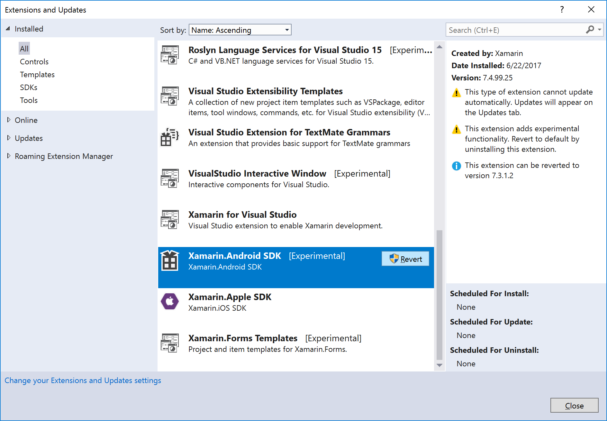
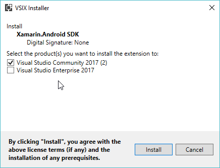

# Jenkins Build Artifacts

The [**Project xamarin-android** Jenkins page][xa-jenkins-page] has a link
to the [Latest Azure Artifacts][xa-macOS-azure-artifacts], which contains an
`oss-xamarin.android*.zip` and `Xamarin.Android.Sdk*.vsix` file for every
Jenkins build on macOS. These files can be downloaded and used, without
requiring a local `xamarin-android` repo build.

[xa-jenkins-page]: https://jenkins.mono-project.com/view/Xamarin.Android/job/xamarin-android/
[xa-macOS-azure-artifacts]: https://jenkins.mono-project.com/view/Xamarin.Android/job/xamarin-android/lastSuccessfulBuild/Azure/

The Jenkins build artifacts do *not* include Android SDK or NDK bits,
while requiring that parts of the Android SDK be installed to work.
Please see the [Android SDK Setup](#Android_SDK_Setup) section for instructions
on setting up the Android NDK & SDK if an Android SDK is not already setup.

# Installing Jenkins Build Artifacts

macOS and Windows users should go to the
[Latest xamarin-android Azure Artifacts][xa-macOS-azure-artifacts] page and
download the `oss-xamarin.android*.zip` file, e.g.
[oss-xamarin.android_v7.4.99.60_Darwin-x86_64_master_4f3d604.zip][oss-xa-macOS].

[oss-xa-macOS]: https://jenkins.mono-project.com/view/Xamarin.Android/job/xamarin-android/499/Azure/processDownloadRequest/xamarin-android/oss-xamarin.android_v7.4.99.60_Darwin-x86_64_master_4f3d604.zip

Windows users using Visual Studio 2017 may instead download the
`Xamarin.Android.Sdk*.vsix` file.

macOS users may just extract this into their **Downloads** folder using
**Archive Utility.app** or `unzip` from **Terminal.app**. This will result
in a file such as:

	$HOME/Downloads/oss-xamarin.android_v7.4.99.60_Darwin-x86_64_master_4f3d604/bin/Debug/bin/xabuild

Linux/x86_64 users can go to the
[Latest xamarin-android-linux Azure Artifacts page][xa-linux-azure-artifacts]
and download the `oss-xamarin.android*.zip` file, e.g.
[xamarin-android/oss-xamarin.android_v7.2.99.19_Linux-x86_64_master_3b893cd.zip][oss-xa-Linux].

[xa-linux-azure-artifacts]: https://jenkins.mono-project.com/view/Xamarin.Android/job/xamarin-android-linux/lastSuccessfulBuild/Azure/
[oss-xa-Linux]: https://jenkins.mono-project.com/view/Xamarin.Android/job/xamarin-android-linux/lastSuccessfulBuild/Azure/processDownloadRequest/xamarin-android/oss-xamarin.android_v7.2.99.19_Linux-x86_64_master_3b893cd.zip

## Windows Installation

There are two ways to install a Jenkins build of Xamarin.Android on Windows:

1. Through the `Xamarin.Android.Sdk-OSS*.vsix` file.
2. Through the `oss-xamarin.android*.zip` file.

### `Xamarin.Android.Sdk-OSS*.vsix` Installation

The `Xamarin.Android.Sdk-OSS*.vsix` file can be installed into
Visual Studio 2017. This requires that the **Xamarin** component be previously
installed within Visual Studio 2017.

Installing the `Xamarin.Android.Sdk-OSS*.vsix` file is easy:
double-click the file within Windows Explorer, and complete the
VSIX Installer window.

The problem is *uninstalling* the `Xamarin.Android.Sdk-OSS.vsix` file, in order
to use the *stable*/commercial version of Xamarin.Android, if desired. The
Jenkins-provided `.vsix` file is [*Experimental*][vsix-schema], which
complicates the uninstallation process.

[vsix-schema]: https://msdn.microsoft.com/en-us/library/hh696828.aspx

When using Visual Studio 15.3 or later, search for `Xamarin.Android` within
the Visual Studio Extension Manager, and then click the **Revert** button
to uninstall the `Xamarn.Android.Sdk-OSS` package and revert to the previously
installed and stable commercial Xamarin.Android version.

Visual Studio 15.2 and earlier do not have a **Revert** button. The only way to
return to a stable Xamarin.Android version is to uninstall and reinstall the
**Xamarin** component from within the Visual Studio 2017 Installer.

For simplicity, we suggest installing *multiple* Visual Studio 2017 products,
e.g. both Visual Studio Community and Visual Studio Professional, and
designating one of them for "stable" use and one for Jenkins use.

Once the `Xamarin.Android.Sdk-OSS*.vsix` file has been downloaded, you can
double-click the file, and within the **VSIX Installer** window you can select
which products the Xamarin.Android SDK should be installed into:

Once you've selected the desired Visual Studio products, click the **Install**
button to install the Xamarin.Android SDK extension into Visual Studio 2017.

### `oss-xamarin.android*.zip` Installation

Windows users can right-click the `oss-xamarin.android*.zip` file within
Windows Explorer and click **Extract All...**, and in the
**Extract Compressed (Zipped) Folders** dialog enter a *short* path such as
`C:\xa-sdk`. This is necessary because some of the contained filenames are
quite long. This will result in a path such as:

	C:\xa-sdk\oss-xamarin.android_v7.4.99.60_Darwin-x86_64_master_4f3d604\bin\Debug\bin\setup-windows.exe

Once the `.zip` file has been extracted, please run the `setup-windows.exe`
utility within the `bin\Debug` or `bin\Release` folders. If you have
Visual Studio 2017 installed, this utility *must* be run within an
Administrator-elevated **Developer Command Prompt for VS 2017** window:

1. In the Start menu, search for **Developer Command Prompt for VS 2017**.
2. Right-click the **Developer Command Prompt for VS 2017** entry.
3. Click **Run as administrator**.

Within the elevated command prompt, execute the `setup-windows.exe` program:

	> C:\xa-sdk\oss-xamarin.android_v7.4.99.60_Darwin-x86_64_master_4f3d604\bin\Debug\bin\setup-windows.exe
	Executing: MKLINK /D "C:\Program Files (x86)\Microsoft Visual Studio\2017\Enterprise\Common7\IDE\ReferenceAssemblies\Microsoft\Framework\MonoAndroid" "C:\xa-sdk\oss-xamarin.android_v7.4.99.57_Darwin-x86_64_master_97f08f7\bin\Debug\lib\xamarin.android\xbuild-frameworks\MonoAndroid"
	Executing: MKLINK /D "C:\Program Files (x86)\Reference Assemblies\Microsoft\Framework\MonoAndroid" "C:\xa-sdk\oss-xamarin.android_v7.4.99.57_Darwin-x86_64_master_97f08f7\bin\Debug\lib\xamarin.android\xbuild-frameworks\MonoAndroid"
	Executing: MKLINK /D "C:\Program Files (x86)\Microsoft Visual Studio\2017\Enterprise\MSBuild\Xamarin\Android" "C:\xa-sdk\oss-xamarin.android_v7.4.99.57_Darwin-x86_64_master_97f08f7\bin\Debug\lib\xamarin.android\xbuild\Xamarin\Android"
	Executing: MKLINK "C:\Program Files (x86)\Microsoft Visual Studio\2017\Enterprise\MSBuild\Xamarin\Xamarin.Android.Sdk.props" "C:\xa-sdk\oss-xamarin.android_v7.4.99.57_Darwin-x86_64_master_97f08f7\bin\Debug\lib\xamarin.android\xbuild\Xamarin\Xamarin.Android.Sdk.props"
	Executing: MKLINK "C:\Program Files (x86)\Microsoft Visual Studio\2017\Enterprise\MSBuild\Xamarin\Xamarin.Android.Sdk.targets" "C:\xa-sdk\oss-xamarin.android_v7.4.99.57_Darwin-x86_64_master_97f08f7\bin\Debug\lib\xamarin.android\xbuild\Xamarin\Xamarin.Android.Sdk.targets"
	Success!

To uninstall, run `setup-windows.exe /uninstall`:

	> C:\xa-sdk\oss-xamarin.android_v7.4.99.60_Darwin-x86_64_master_4f3d604\bin\Debug\bin\setup-windows.exe /uninstall

The `setup-windows.exe` utility checks for an existing Xamarin.Android install,
renames the existing directories for backup/easy restoration purposes, then
create symbolic links into the extracted Xamarin.Android directory.

(Unfortunately, this means that you can't easily have side-by-side installs
of the Xamarin.Android SDK. Only one install can be active at a time.)

If Visual Studio 2017 isn't installed, it should be fine to right-click
`setup-windows.exe` from within Windows Explorer, then click
**Run as administrator**. (`setup-windows.exe` will *not* do the correct thing
when Visual Studio 2017 is installed, as `%VSINSTALLDIR%` isn't properly
set outside of the Developer Command Prompt for VS 2017, so the *global*
`%ProgramFiles(x86)%\MSBuild\Xamarin\Android` directory is modified, not the
per-SKU Visual Studio 2017 directory.)

# Using Jenkins Build Artifacts

## Command-line use: Linux and macOS

Within the `oss-xamarin.android*.zip` extracted contents is a
`oss-xamarin.android*/bin/Debug/bin/xabuild` script.

`xabuild` requires that the `$ANDROID_SDK_PATH` and `$ANDROID_NDK_PATH`
environment variables be set to the location of the Android SDK and
Android NDK directories, respectively.

If you have a xamarin-android build environment, then
`$HOME/android-toolchain` will contain an Android SDK and NDK:

	export ANDROID_SDK_PATH=$HOME/android-toolchain/sdk
	export ANDROID_NDK_PATH=$HOME/android-toolchain/ndk

If you followed the [Android SDK Setup](#Android_SDK_Setup) instructions, then:

	export ANDROID_SDK_PATH=$HOME/xa-sdk/android-sdk
	export ANDROID_NDK_PATH=$HOME/xa-sdk/android-ndk/android-ndk-r14

Once the `oss-xamarin.android*.zip` file has been installed, Unix users
may use the `oss-xamarin.android*/bin/Debug/bin/xabuild` script to build
projects.

	# macOS users: build the xamarin-android HelloWorld.csproj sample
	$HOME/Downloads/oss-xamarin.android_v7.2.99.19_Darwin-x86_64_master_3b893cd/bin/Debug/bin/xabuild \
		/t:SignAndroidPackage \
		samples/HelloWorld/HelloWorld.csproj

<a name="cmd-use-Windows" />

## Command-line use: Windows

There is not currently an `xabuild.cmd` script for Windows use. Instead,
Windows users should execute `msbuild.exe` directly, providing the following
MSBuild properties:

* `AndroidSdkDirectory`: The location of the Android SDK.
* `AndroidNdkDirectory`: The location of the Android NDK.
* `JavaSdkDirectory`:  The location of the Java SDK/JDK.

For example (using the paths from [Android SDK Setup](#Android_SDK_Setup)):

	msbuild /p:AndroidSdkDirectory="C:\xa-sdk\android-sdk" ^
		/p:AndroidNdkDirectory="C:\xa-sdk\android-ndk\android-ndk-r14" ^
		/t:SignAndroidPackage ^
		samples\HelloWorld\HelloWorld.csproj

<a name="Android_SDK_Setup" />

# Android SDK Setup

Please see the [Android Studio][android-studio] page to download the
Android SDK, if you do not already have the Android SDK installed.
If you don't want Android Studio, you can follow the
**Get just the command line tools** section at the Android Studio page.

[android-studio]: https://developer.android.com/studio/index.html

The Android NDK can be downloaded from the [NDK Downloads][ndk-downloads]
page.

[ndk-downloads]: https://developer.android.com/ndk/downloads/index.html

## macOS Android SDK Setup

Download the macOS SDK tools package, e.g.
[tools_r25.2.3-macosx.zip][android-tools-macOS], and the
    macOS NDK package, e.g. [android-ndk-r14-darwin-x86_64.zip][ndk-macOS]

[android-tools-macOS]: https://dl.google.com/android/repository/tools_r25.2.3-macosx.zip
[ndk-macOS]: https://dl.google.com/android/repository/android-ndk-r14-darwin-x86_64.zip

Within **Terminal.app**, run the following commands, assuming that the
above mentioned files were downloaded into `$HOME/Downloads`, and we want
to create a new Android SDK & NDK within `$HOME/xa-sdk`:

	mkdir -p $HOME/xa-sdk/android-sdk
	cd $HOME/xa-sdk/android-sdk
	unzip $HOME/Downloads/tools_r25.2.3-macosx.zip
	tools/bin/sdkmanager "build-tools;25.0.2"
	tools/bin/sdkmanager "platform-tools"
	tools/bin/sdkmanager "platforms;android-25"
	
	mkdir -p $HOME/xa-sdk/android-ndk
	cd $HOME/xa-sdk/android-ndk
	unzip $HOME/Downloads/android-ndk-r14-darwin-x86_64.zip

## Windows Android SDK Setup

1. Download the Windows SDK tools package, e.g.
[tools_r25.2.3-windows.zip][android-tools-windows], and the
    Windows NDK package, e.g. [android-ndk-r14-windows-x86.zip][ndk-win64]

[android-tools-windows]: https://dl.google.com/android/repository/tools_r25.2.3-windows.zip
[ndk-win64]: https://dl.google.com/android/repository/android-ndk-r14-windows-x86.zip

2. Right-click the `tools*.zip` file within Explorer, then click
    **Extract All...**
3. Within the **Extract Compressed (Zipped) Folders** dialog, enter
    a path such as `C:\xa-sdk\android-sdk`. Click **Next**.
4. Right-click the `android-ndk*.zip` file within Explorer, then click
    **Extract All...**
5. Within the **Extract Compressed (Zipped) Folders** dialog, enter
    a path such as `C:\xa-sdk\android-ndk`. Click **Next**.
6. Within `cmd.exe`, execute the following commands:

        cd C:\xa-sdk\android-sdk
        tools\bin\sdkmanager "build-tools;25.0.2"
        tools\bin\sdkmanager "platform-tools"
        tools\bin\sdkmanager "platforms;android-25"
