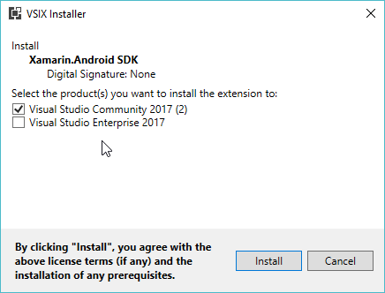

# Open Source Build Artifacts

The [**Xamarin.Android-OSS** Azure Pipeline][xa-oss-pipeline] contains a list of all
recent builds.  To view Open Source software (OSS) artifacts for a specific build:

 1) Click on the build `Run` that you are interested in.
 2) At the top of the `Summary` tab in the `Related` section, there should be a link titled `'x' published`.
 3) Click on the `'x' published` link.
 4) Scroll over any relevant artifacts with the `Installers -` prefix, and an ellipses should appear on the right side of the artifact with a download option.

[xa-oss-pipeline]: https://dev.azure.com/xamarin/public/_build?definitionId=48&_a=summary

The Open Source software (OSS) build artifacts do *not* include Android SDK or NDK bits,
while requiring that parts of the Android SDK be installed to work.
Please see the [Android SDK Setup](#Android_SDK_Setup) section for instructions
on setting up the Android NDK & SDK if an Android SDK is not already setup.

# Installing Build Artifacts

The OSS pipeline should contain OSS installer packages for Linux, macOS, and Windows.

## Linux (Debian) Installation

Download the `xamarin.android-oss*.deb` package and double click to install.

## macOS Installation

Download the `Xamarin.Android.Sdk-OSS*.pkg` package and double click to install.

## Windows Installation

The `Xamarin.Android.Sdk-OSS*.vsix` file can be installed into
Visual Studio 2019. This requires that the **Mobile development with .NET** 
workload be previously installed within Visual Studio 2019.

Installing the `Xamarin.Android.Sdk-OSS*.vsix` file is easy:
double-click the file within Windows Explorer, and complete the
VSIX Installer window.

The problem is *uninstalling* the `Xamarin.Android.Sdk-OSS.vsix` file, in order
to use the *stable*/commercial version of Xamarin.Android, if desired. The
OSS `.vsix` file is [*Experimental*][vsix-schema], which
complicates the uninstallation process.

[vsix-schema]: https://msdn.microsoft.com/en-us/library/hh696828.aspx

When using Visual Studio 15.3 or later, search for `Xamarin.Android` within
the Visual Studio Extension Manager, and then click the **Revert** button
to uninstall the `Xamarn.Android.Sdk-OSS` package and revert to the previously
installed and stable commercial Xamarin.Android version.

Visual Studio 15.2 and earlier do not have a **Revert** button. The only way to
return to a stable Xamarin.Android version is to uninstall and reinstall the
**Mobile development with .NET** component from within the Visual Studio Installer.

For simplicity, we suggest installing *multiple* Visual Studio 2019 products,
e.g. both Visual Studio Community and Visual Studio Professional, and
designating one of them for "stable" use and one for OSS use as needed.

Once the `Xamarin.Android.Sdk-OSS*.vsix` file has been downloaded, you can
double-click the file, and within the **VSIX Installer** window you can select
which products the Xamarin.Android SDK should be installed into:

Once you've selected the desired Visual Studio products, click the **Install**
button to install the Xamarin.Android SDK extension into Visual Studio 2019.

# Using OSS Build Artifacts

OSS artifacts can be used in the same way commercial artifacts are used, from within 
Visual Studio, Visual Studio for Mac, or command line.  Do note however that there are
various limitations with debugging and debug deployment options when using OSS artifacts.

## Command-line use: Linux and macOS

Within the `oss-xamarin.android*.zip` extracted contents is a
`oss-xamarin.android*/bin/Debug/bin/xabuild` script.

`xabuild` requires that the `$ANDROID_SDK_PATH` and `$ANDROID_NDK_PATH`
environment variables be set to the location of the Android SDK and
Android NDK directories, respectively.

If you have a xamarin-android build environment, then
`$HOME/android-toolchain` will contain an Android SDK and NDK:

	export ANDROID_SDK_PATH=$HOME/android-toolchain/sdk
	export ANDROID_NDK_PATH=$HOME/android-toolchain/ndk

If you followed the [Android SDK Setup](#Android_SDK_Setup) instructions, then:

	export ANDROID_SDK_PATH=$HOME/xa-sdk/android-sdk
	export ANDROID_NDK_PATH=$HOME/xa-sdk/android-ndk/android-ndk-r14

Once the `oss-xamarin.android*.zip` file has been installed, Unix users
may use the `oss-xamarin.android*/bin/Debug/bin/xabuild` script to build
projects.

	# macOS users: build the xamarin-android HelloWorld.csproj sample
	$HOME/Downloads/oss-xamarin.android_v7.2.99.19_Darwin-x86_64_master_3b893cd/bin/Debug/bin/xabuild \
		/t:SignAndroidPackage \
		samples/HelloWorld/HelloWorld.csproj

<a name="cmd-use-Windows" />

## Command-line use: Windows

There is not currently an `xabuild.cmd` script for Windows use. Instead,
Windows users should execute `msbuild.exe` directly, providing the following
MSBuild properties:

* `AndroidSdkDirectory`: The location of the Android SDK.
* `AndroidNdkDirectory`: The location of the Android NDK.
* `JavaSdkDirectory`:  The location of the Java SDK/JDK.

For example (using the paths from [Android SDK Setup](#Android_SDK_Setup)):

	msbuild /p:AndroidSdkDirectory="C:\xa-sdk\android-sdk" ^
		/p:AndroidNdkDirectory="C:\xa-sdk\android-ndk\android-ndk-r14" ^
		/t:SignAndroidPackage ^
		samples\HelloWorld\HelloWorld.csproj

<a name="Android_SDK_Setup" />

# Android SDK Setup

Please see the [Android Studio][android-studio] page to download the
Android SDK, if you do not already have the Android SDK installed.
If you don't want Android Studio, you can follow the
**Get just the command line tools** section at the Android Studio page.

[android-studio]: https://developer.android.com/studio/index.html

The Android NDK can be downloaded from the [NDK Downloads][ndk-downloads]
page.

[ndk-downloads]: https://developer.android.com/ndk/downloads/index.html

## macOS Android SDK Setup

Download the macOS SDK tools package, e.g.
[tools_r25.2.3-macosx.zip][android-tools-macOS], and the
    macOS NDK package, e.g. [android-ndk-r14-darwin-x86_64.zip][ndk-macOS]

[android-tools-macOS]: https://dl.google.com/android/repository/tools_r25.2.3-macosx.zip
[ndk-macOS]: https://dl.google.com/android/repository/android-ndk-r14-darwin-x86_64.zip

Within **Terminal.app**, run the following commands, assuming that the
above mentioned files were downloaded into `$HOME/Downloads`, and we want
to create a new Android SDK & NDK within `$HOME/xa-sdk`:

	mkdir -p $HOME/xa-sdk/android-sdk
	cd $HOME/xa-sdk/android-sdk
	unzip $HOME/Downloads/tools_r25.2.3-macosx.zip
	tools/bin/sdkmanager "build-tools;25.0.2"
	tools/bin/sdkmanager "platform-tools"
	tools/bin/sdkmanager "platforms;android-25"
	
	mkdir -p $HOME/xa-sdk/android-ndk
	cd $HOME/xa-sdk/android-ndk
	unzip $HOME/Downloads/android-ndk-r14-darwin-x86_64.zip

## Windows Android SDK Setup

1. Download the Windows SDK tools package, e.g.
[tools_r25.2.3-windows.zip][android-tools-windows], and the
    Windows NDK package, e.g. [android-ndk-r14-windows-x86.zip][ndk-win64]

[android-tools-windows]: https://dl.google.com/android/repository/tools_r25.2.3-windows.zip
[ndk-win64]: https://dl.google.com/android/repository/android-ndk-r14-windows-x86.zip

2. Right-click the `tools*.zip` file within Explorer, then click
    **Extract All...**
3. Within the **Extract Compressed (Zipped) Folders** dialog, enter
    a path such as `C:\xa-sdk\android-sdk`. Click **Next**.
4. Right-click the `android-ndk*.zip` file within Explorer, then click
    **Extract All...**
5. Within the **Extract Compressed (Zipped) Folders** dialog, enter
    a path such as `C:\xa-sdk\android-ndk`. Click **Next**.
6. Within `cmd.exe`, execute the following commands:

        cd C:\xa-sdk\android-sdk
        tools\bin\sdkmanager "build-tools;25.0.2"
        tools\bin\sdkmanager "platform-tools"
        tools\bin\sdkmanager "platforms;android-25"
